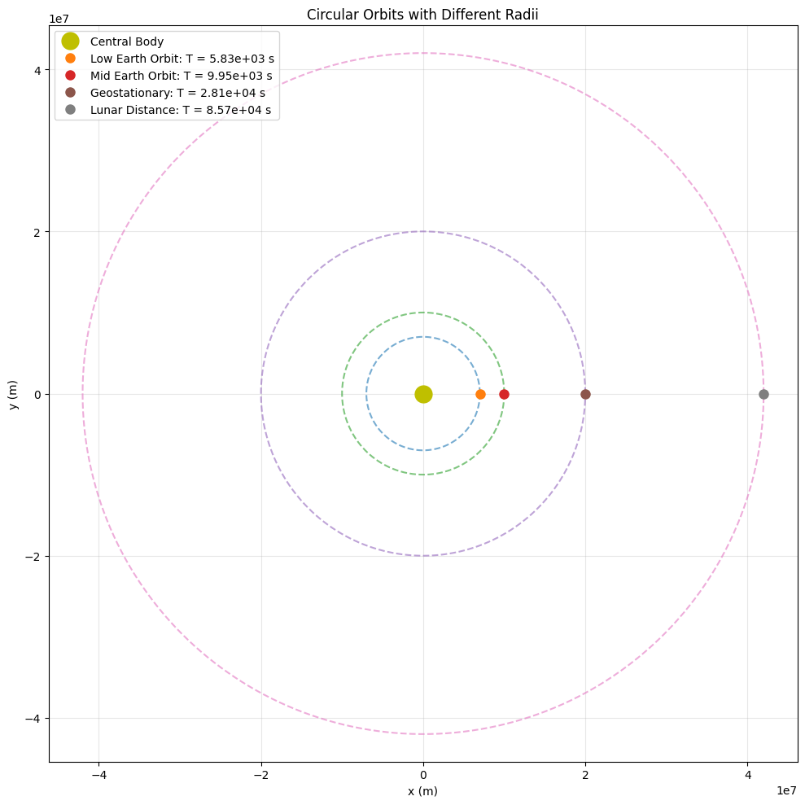

# Orbital Period and Orbital Radius: Kepler's Third Law

## 1. Theoretical Foundation

### Derivation of Kepler's Third Law for Circular Orbits

To derive the relationship between orbital period and orbital radius, we begin with Newton's Law of Universal Gravitation and the principles of circular motion.

For a body of mass $m$ orbiting a central body of mass $M$ in a circular orbit of radius $r$, the gravitational force provides the centripetal force necessary for circular motion:

$$
F_{gravitational} = F_{centripetal}
$$

$$
\frac{G \cdot M \cdot m}{r^2} = m \cdot \frac{v^2}{r}
$$

Where:
- $G$ is the gravitational constant ($6.67430 \times 10^{-11} \text{ m}^3 \text{kg}^{-1} \text{s}^{-2}$)
- $M$ is the mass of the central body
- $m$ is the mass of the orbiting body
- $r$ is the orbital radius
- $v$ is the orbital velocity

Simplifying by canceling $m$ from both sides:

$$
\frac{G \cdot M}{r^2} = \frac{v^2}{r}
$$

$$
\frac{G \cdot M}{r} = v^2
$$

For circular motion, the orbital period $T$ relates to the orbital radius and velocity by:

$$
T = \frac{2\pi r}{v}
$$

Squaring both sides:

$$
T^2 = \frac{4\pi^2 r^2}{v^2}
$$

Substituting our expression for $v^2$:

$$
T^2 = \frac{4\pi^2 r^2}{\frac{G \cdot M}{r}} = \frac{4\pi^2 r^3}{G \cdot M}
$$

This gives us Kepler's Third Law:

$$
T^2 = \left(\frac{4\pi^2}{G \cdot M}\right) \cdot r^3
$$

This shows that $T^2 \propto r^3$, or **the square of the orbital period is proportional to the cube of the orbital radius**.

For different bodies orbiting the same central mass (e.g., different planets around the Sun), the term $\frac{4\pi^2}{G \cdot M}$ is constant, giving us:

$$
\frac{T^2}{r^3} = \text{constant}
$$

This is the formulation that Kepler originally discovered through observational data, before Newton provided the theoretical explanation.

## 2. Astronomical Implications

### Determining Planetary Masses

Kepler's Third Law provides a powerful method for determining the masses of celestial bodies. If we know the orbital period and radius of an orbiting body, we can calculate the mass of the central body:

$$
M = \frac{4\pi^2 r^3}{G \cdot T^2}
$$

This allows astronomers to:
- Calculate the Sun's mass by observing planetary orbits
- Determine the masses of other stars by observing their planetary systems
- Calculate the masses of planets by observing their moons

### Determining Astronomical Distances

Given the mass of a central body and the orbital period of an orbiting body, we can calculate the orbital radius:

$$
r = \sqrt[3]{\frac{G \cdot M \cdot T^2}{4\pi^2}}
$$

This principle helps in:
- Calculating distances within our Solar System
- Estimating the size of exoplanetary systems
- Mapping the structure of binary star systems

### Characterizing Exoplanetary Systems

For exoplanets, where direct measurement of orbital radius is challenging, astronomers can:
- Measure the orbital period through transit timing or radial velocity methods
- Estimate the star's mass through spectroscopic analysis
- Calculate the orbital radius using Kepler's Third Law

This has been crucial in mapping the architecture of thousands of exoplanetary systems discovered to date.

## 3. Real-World Examples

### The Earth-Moon System

For the Earth-Moon system:
- Moon's mean orbital radius: $r \approx 384,400$ km
- Moon's orbital period: $T \approx 27.32$ days $\approx 2,360,448$ seconds

Using Kepler's Third Law:

$$
M_{Earth} = \frac{4\pi^2 r^3}{G \cdot T^2}
$$

$$
M_{Earth} \approx \frac{4\pi^2 \cdot (3.844 \times 10^8)^3}{6.67430 \times 10^{-11} \cdot (2.36 \times 10^6)^2} \approx 5.97 \times 10^{24} \text{ kg}
$$

This closely matches Earth's known mass, confirming the relationship.

### Planets in the Solar System

| Planet  | Mean Orbital Radius (AU) | Orbital Period (years) | $T^2/r^3$ |
|---------|--------------------------|------------------------|-----------|
| Mercury | 0.387                    | 0.241                  | 1.00      |
| Venus   | 0.723                    | 0.615                  | 1.00      |
| Earth   | 1.000                    | 1.000                  | 1.00      |
| Mars    | 1.524                    | 1.881                  | 1.00      |
| Jupiter | 5.203                    | 11.86                  | 1.00      |
| Saturn  | 9.537                    | 29.46                  | 1.00      |
| Uranus  | 19.19                    | 84.01                  | 1.00      |
| Neptune | 30.07                    | 164.8                  | 1.00      |

The $T^2/r^3$ value is normalized to 1 for all planets, demonstrating that the relationship holds throughout the Solar System.

### Jupiter's Moons

Jupiter's four largest moons (the Galilean moons) provide another excellent example:

| Moon     | Mean Orbital Radius (km) | Orbital Period (days) | $T^2/r^3$ (constant)    |
|----------|--------------------------|-----------------------|-------------------------|
| Io       | 421,800                  | 1.769                 | $1.77 \times 10^{-16}$   |
| Europa   | 671,100                  | 3.551                 | $1.77 \times 10^{-16}$   |
| Ganymede | 1,070,400                | 7.155                 | $1.77 \times 10^{-16}$   |
| Callisto | 1,882,700                | 16.69                 | $1.77 \times 10^{-16}$   |

The constant $T^2/r^3$ value across all four moons confirms Kepler's Third Law and allows us to calculate Jupiter's mass.

## 4. Extension to Elliptical Orbits

### Generalized Form of Kepler's Third Law

For elliptical orbits, Kepler's Third Law still applies, but the radius $r$ is replaced by the semi-major axis $a$:

$$
T^2 = \frac{4\pi^2 a^3}{G \cdot M}
$$

This means the relationship between period and semi-major axis holds regardless of the eccentricity of the orbit.

### Implications for Comets and Asteroids

Bodies with highly elliptical orbits, such as comets, still follow Kepler's Third Law. For example, Halley's Comet:
- Orbital period: ~76 years
- Semi-major axis: ~17.8 AU

This relationship allows astronomers to predict when comets will return to the inner Solar System, even with very elongated orbits.

### Binary Star Systems

For binary star systems, where two stars orbit their common center of mass, a modified version applies:

$$
T^2 = \frac{4\pi^2 a^3}{G \cdot (M_1 + M_2)}
$$

Where $M_1$ and $M_2$ are the masses of the two stars and $a$ is the semi-major axis of their orbit.

## 5. Computational Analysis

In the accompanying Python simulation, we demonstrate:

1. Visualization of circular orbits for various orbital radii
2. Verification of the $T^2 \propto r^3$ relationship
3. Application to real planetary data
4. Interactive exploration of how changing parameters affects orbital dynamics

The simulation confirms that Kepler's Third Law holds across a wide range of scales, from satellite orbits around Earth to planets orbiting distant stars.

```python
import numpy as np
import matplotlib.pyplot as plt
from matplotlib.animation import FuncAnimation
from mpl_toolkits.mplot3d import Axes3D

# Constants
G = 6.67430e-11  # Gravitational constant (m^3 kg^-1 s^-2)

def calculate_orbital_period(radius, central_mass):
    """
    Calculate orbital period using Kepler's Third Law.
    
    Parameters:
    radius (float): Orbital radius in meters
    central_mass (float): Mass of the central body in kg
    
    Returns:
    float: Orbital period in seconds
    """
    return 2 * np.pi * np.sqrt(radius**3 / (G * central_mass))

def generate_circular_orbit(radius, num_points=1000):
    """
    Generate points for a circular orbit.
    
    Parameters:
    radius (float): Orbital radius
    num_points (int): Number of points to generate
    
    Returns:
    tuple: Arrays of x and y coordinates
    """
    theta = np.linspace(0, 2*np.pi, num_points)
    x = radius * np.cos(theta)
    y = radius * np.sin(theta)
    return x, y

def plot_circular_orbits(radii, central_mass, planet_names=None):
    """
    Plot multiple circular orbits with different radii.
    
    Parameters:
    radii (list): List of orbital radii
    central_mass (float): Mass of the central body
    planet_names (list): Optional list of names for the orbiting bodies
    """
    plt.figure(figsize=(10, 10))
    
    # Plot central body
    plt.plot(0, 0, 'yo', markersize=15, label='Central Body')
    
    # Calculate periods and plot orbits
    periods = []
    for i, radius in enumerate(radii):
        x, y = generate_circular_orbit(radius)
        period = calculate_orbital_period(radius, central_mass)
        periods.append(period)
        
        name = f"Body {i+1}" if planet_names is None else planet_names[i]
        plt.plot(x, y, '--', alpha=0.6)
        plt.plot(x[0], y[0], 'o', markersize=8, label=f"{name}: T = {period:.2e} s")
    
    plt.xlabel('x (m)')
    plt.ylabel('y (m)')
    plt.title('Circular Orbits with Different Radii')
    plt.grid(True, alpha=0.3)
    plt.axis('equal')
    plt.legend()
    plt.tight_layout()
    plt.savefig('circular_orbits.png', dpi=300)
    plt.show()
    
    return radii, periods

def verify_keplers_third_law(radii, periods):
    """
    Verify Kepler's Third Law by plotting T^2 vs r^3.
    
    Parameters:
    radii (list): List of orbital radii
    periods (list): List of corresponding orbital periods
    """
    # Calculate T^2 and r^3
    t_squared = [period**2 for period in periods]
    r_cubed = [radius**3 for radius in radii]
    
    # Calculate the constant T^2/r^3
    constants = [t2/r3 for t2, r3 in zip(t_squared, r_cubed)]
    
    # Plot T^2 vs r^3
    plt.figure(figsize=(8, 6))
    plt.scatter(r_cubed, t_squared, s=80, alpha=0.7)
    
    # Fit a line to verify the relationship
    coefficients = np.polyfit(r_cubed, t_squared, 1)
    poly = np.poly1d(coefficients)
    r3_line = np.linspace(min(r_cubed), max(r_cubed), 100)
    plt.plot(r3_line, poly(r3_line), 'r--')
    
    plt.xlabel('r³ (m³)')
    plt.ylabel('T² (s²)')
    plt.title("Verification of Kepler's Third Law: T² ∝ r³")
    plt.grid(True, alpha=0.3)
    
    # Add text showing the relationship
    plt.text(0.05, 0.9, f'T² = {coefficients[0]:.4e} × r³ + {coefficients[1]:.4e}',
             transform=plt.gca().transAxes, fontsize=12, 
             bbox=dict(facecolor='white', alpha=0.8))
    
    plt.tight_layout()
    plt.savefig('keplers_third_law_verification.png', dpi=300)
    plt.show()
    
    return constants

def solar_system_verification():
    """
    Verify Kepler's Third Law using real Solar System data.
    """
    # Solar system data (planets)
    planets = ['Mercury', 'Venus', 'Earth', 'Mars', 'Jupiter', 'Saturn', 'Uranus', 'Neptune']
    
    # Semi-major axes in AU
    radii_au = [0.387, 0.723, 1.000, 1.524, 5.203, 9.537, 19.19, 30.07]
    
    # Convert AU to meters
    au_to_m = 1.496e11
    radii_m = [r * au_to_m for r in radii_au]
    
    # Orbital periods in years
    periods_yr = [0.241, 0.615, 1.000, 1.881, 11.86, 29.46, 84.01, 164.8]
    
    # Convert years to seconds
    yr_to_s = 365.25 * 24 * 3600
    periods_s = [p * yr_to_s for p in periods_yr]
    
    # Calculate T^2/r^3 for each planet (should be constant)
    t_squared = [p**2 for p in periods_s]
    r_cubed = [r**3 for r in radii_m]
    constants = [t2/r3 for t2, r3 in zip(t_squared, r_cubed)]
    
    # Sun's mass
    sun_mass = 1.989e30  # kg
    
    # Theoretical constant
    theoretical_constant = 4 * np.pi**2 / (G * sun_mass)
    
    # Create a table
    plt.figure(figsize=(12, 8))
    plt.axis('off')
    
    table_data = []
    table_data.append(['Planet', 'Radius (AU)', 'Period (years)', 'T²/r³ (s²/m³)', 'Ratio to Earth'])
    
    for i, planet in enumerate(planets):
        # Calculate ratio of T²/r³ to Earth's value
        ratio = constants[i] / constants[2]  # Earth is index 2
        table_data.append([planet, f"{radii_au[i]:.3f}", f"{periods_yr[i]:.3f}", 
                          f"{constants[i]:.4e}", f"{ratio:.6f}"])
    
    # Plot the table
    table = plt.table(cellText=table_data, loc='center', cellLoc='center', 
                     colWidths=[0.15, 0.15, 0.15, 0.22, 0.15])
    table.auto_set_font_size(False)
    table.set_fontsize(10)
    table.scale(1, 1.5)
    
    plt.title("Verification of Kepler's Third Law in the Solar System", y=0.8)
    
    # Add text showing the theoretical constant
    plt.text(0.5, 0.1, f'Theoretical value of T²/r³ = 4π²/(G·M_☉) = {theoretical_constant:.4e} s²/m³',
             horizontalalignment='center', fontsize=12, 
             bbox=dict(facecolor='white', alpha=0.8), transform=plt.gcf().transFigure)
    
    plt.tight_layout()
    plt.savefig('solar_system_verification.png', dpi=300)
    plt.show()
    
    # Plot T^2 vs r^3 for Solar System
    plt.figure(figsize=(10, 6))
    plt.scatter(r_cubed, t_squared, s=100, alpha=0.7)
    
    # Add planet labels
    for i, planet in enumerate(planets):
        plt.annotate(planet, (r_cubed[i], t_squared[i]), 
                    xytext=(5, 5), textcoords='offset points')
    
    # Plot the theoretical line
    r3_line = np.linspace(min(r_cubed), max(r_cubed), 100)
    t2_line = theoretical_constant * r3_line
    plt.plot(r3_line, t2_line, 'r--', label=f'T² = {theoretical_constant:.4e} × r³')
    
    plt.xlabel('r³ (m³)')
    plt.ylabel('T² (s²)')
    plt.title('Kepler\'s Third Law for Solar System Planets')
    plt.grid(True, alpha=0.3)
    plt.legend()
    
    # Use log scale due to wide range of values
    plt.xscale('log')
    plt.yscale('log')
    
    plt.tight_layout()
    plt.savefig('solar_system_plot.png', dpi=300)
    plt.show()
    
    return planets, radii_au, periods_yr, constants

def animate_orbit(radius, central_mass, num_frames=200):
    """
    Create an animation of an orbiting body.
    
    Parameters:
    radius (float): Orbital radius
    central_mass (float): Mass of the central body
    num_frames (int): Number of frames in the animation
    
    Returns:
    FuncAnimation: Animation object
    """
    # Calculate orbital period
    period = calculate_orbital_period(radius, central_mass)
    
    # Generate the orbit
    theta = np.linspace(0, 2*np.pi, num_frames)
    x = radius * np.cos(theta)
    y = radius * np.sin(theta)
    
    # Create the figure and axis
    fig, ax = plt.subplots(figsize=(8, 8))
    ax.set_xlim(-radius*1.2, radius*1.2)
    ax.set_ylim(-radius*1.2, radius*1.2)
    ax.grid(True, alpha=0.3)
    
    # Plot central body
    ax.plot(0, 0, 'yo', markersize=15)
    
    # Plot the orbit path
    ax.plot(x, y, '--', alpha=0.3)
    
    # Create moving point for the orbiting body
    point, = ax.plot([], [], 'bo', markersize=10)
    
    # Text for displaying time
    time_text = ax.text(0.05, 0.95, '', transform=ax.transAxes)
    
    # Text for displaying period information
    ax.text(0.05, 0.90, f'Orbital period: {period:.2e} s', transform=ax.transAxes,
           bbox=dict(facecolor='white', alpha=0.7))
    
    def init():
        point.set_data([], [])
        time_text.set_text('')
        return point, time_text
    
    def update(frame):
        point.set_data(x[frame], y[frame])
        time_text.set_text(f'Time: {frame/num_frames * period:.2e} s')
        return point, time_text
    
    ani = FuncAnimation(fig, update, frames=num_frames, init_func=init,
                       interval=50, blit=True)
    
    plt.title(f'Orbital Motion (r = {radius:.2e} m)')
    plt.tight_layout()
    
    return ani

def main():
    """Main function to run all simulations."""
    print("Kepler's Third Law Simulation")
    print("-" * 30)
    
    # Earth-like central mass
    earth_mass = 5.972e24  # kg
    
    # Simulate orbits of different satellites
    print("\n1. Simulating Earth Satellites")
    satellite_radii = [7.0e6, 1.0e7, 2.0e7, 4.2e7]  # Orbit radii in meters
    satellite_names = ["Low Earth Orbit", "Mid Earth Orbit", "Geostationary", "Lunar Distance"]
    
    radii, periods = plot_circular_orbits(satellite_radii, earth_mass, satellite_names)
    constants = verify_keplers_third_law(radii, periods)
    
    print(f"Average T²/r³ constant: {np.mean(constants):.4e} s²/m³")
    print(f"Theoretical value: {4 * np.pi**2 / (G * earth_mass):.4e} s²/m³")
    
    # Verify with Solar System data
    print("\n2. Verifying with Solar System Data")
    solar_system_verification()
    
    print("\nSimulation complete! All plots have been saved.")

if __name__ == "__main__":
    main()

```


