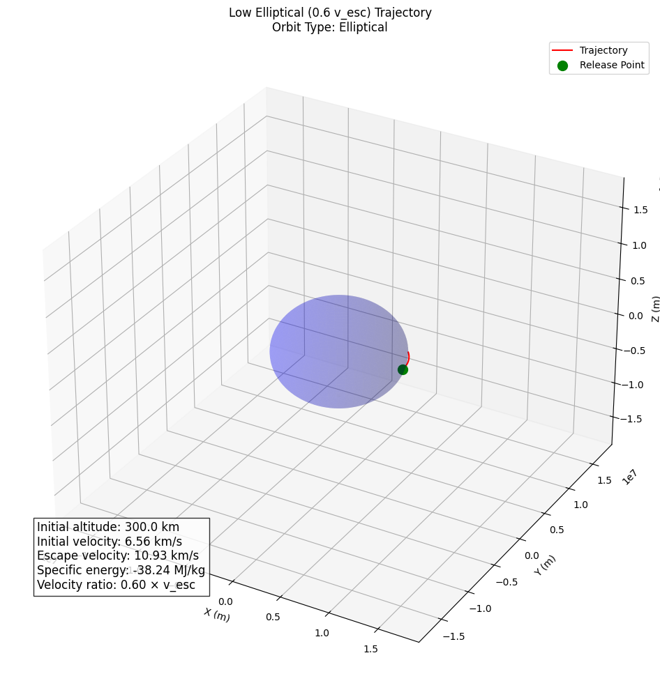
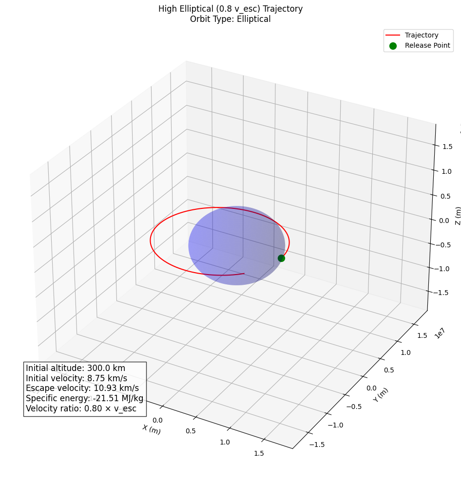
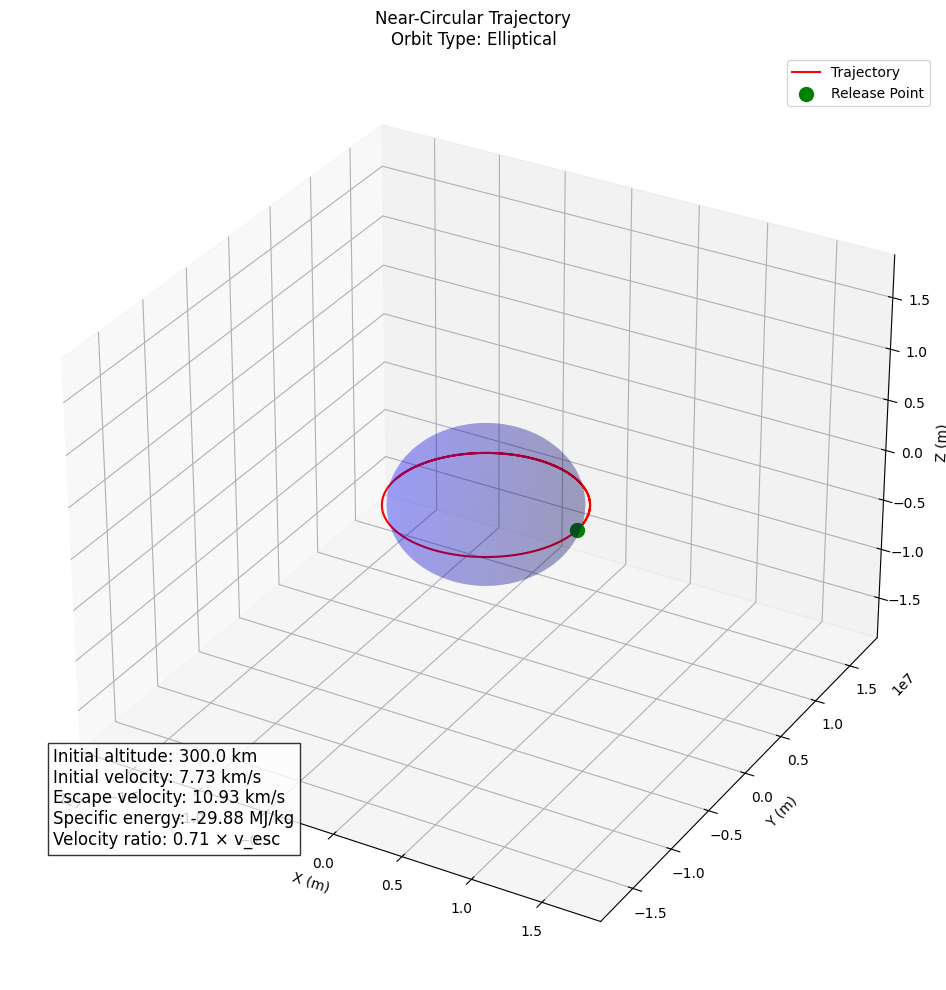
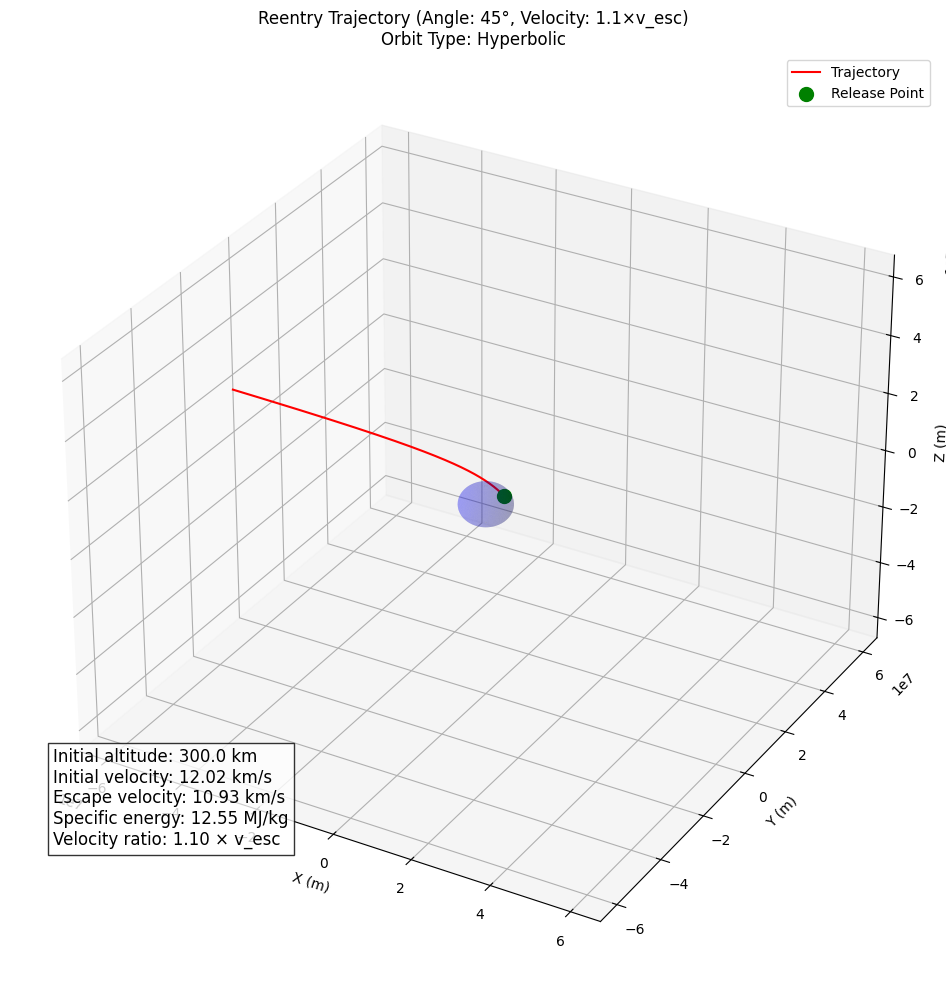

# Trajectories of a Freely Released Payload Near Earth

## Introduction
This document examines the behavior of objects released from moving rockets in Earth's vicinity. Understanding these trajectories is fundamental to space mission planning, satellite deployment, and payload reentry operations. We will analyze the physics governing these motions, implement computational simulations, and visualize the resulting trajectories.

## Theoretical Foundation

### Gravitational Fundamentals
The motion of a payload near Earth is primarily governed by Newton's Law of Gravitation:

$F = G \frac{m_1 m_2}{r^2}$

Where:
- $F$ is the gravitational force between two masses
- $G$ is the gravitational constant ($6.67430 \times 10^{-11} \text{ m}^3 \text{ kg}^{-1} \text{ s}^{-2}$)
- $m_1$ and $m_2$ are the masses of the two objects
- $r$ is the distance between the centers of the masses

For a payload near Earth, this simplifies to:

$\vec{F} = m \cdot \vec{g}(r)$

Where:
- $m$ is the mass of the payload
- $\vec{g}(r)$ is the gravitational acceleration at distance $r$ from Earth's center
- $g(r) = G \frac{M_E}{r^2}$
- $M_E$ is Earth's mass ($5.97219 \times 10^{24} \text{ kg}$)

### Equations of Motion
The payload's motion follows these differential equations:

$\frac{d^2\vec{r}}{dt^2} = -G \frac{M_E}{r^3} \vec{r}$

In Cartesian coordinates (x, y, z), these expand to:

$\frac{d^2x}{dt^2} = -G \frac{M_E}{r^3} x$

$\frac{d^2y}{dt^2} = -G \frac{M_E}{r^3} y$

$\frac{d^2z}{dt^2} = -G \frac{M_E}{r^3} z$

Where $r = \sqrt{x^2 + y^2 + z^2}$

### Orbit Classification
The trajectory type depends on the payload's specific mechanical energy:

$\epsilon = \frac{v^2}{2} - \frac{G M_E}{r}$

This energy determines the orbit type:
- $\epsilon < 0$: Elliptical orbit (closed, payload remains bound to Earth)
- $\epsilon = 0$: Parabolic trajectory (escape with zero excess energy)
- $\epsilon > 0$: Hyperbolic trajectory (escape with excess energy)

The escape velocity at distance $r$ from Earth's center is:

$v_{esc} = \sqrt{\frac{2 G M_E}{r}}$

At Earth's surface ($r = R_E = 6,371 \text{ km}$), this equals approximately $11.2 \text{ km/s}$.

## Numerical Implementation

```python
import numpy as np
import matplotlib.pyplot as plt
from scipy.integrate import solve_ivp
from mpl_toolkits.mplot3d import Axes3D

# Constants
G = 6.67430e-11  # Gravitational constant (m^3 kg^-1 s^-2)
M_E = 5.97219e24  # Earth's mass (kg)
R_E = 6371000  # Earth's radius (m)

def gravitational_acceleration(t, state):
    """Calculate gravitational acceleration for a given state [x, y, z, vx, vy, vz]"""
    x, y, z, vx, vy, vz = state
    r = np.sqrt(x**2 + y**2 + z**2)
    
    # Check if payload has crashed into Earth
    if r < R_E:
        return np.zeros(6)
    
    # Acceleration components
    ax = -G * M_E * x / r**3
    ay = -G * M_E * y / r**3
    az = -G * M_E * z / r**3
    
    return np.array([vx, vy, vz, ax, ay, az])

def simulate_trajectory(initial_position, initial_velocity, t_max=10000, t_step=10):
    """Simulate the trajectory of a payload with given initial conditions"""
    initial_state = np.concatenate((initial_position, initial_velocity))
    t_span = (0, t_max)
    t_eval = np.arange(0, t_max, t_step)
    
    solution = solve_ivp(
        gravitational_acceleration, 
        t_span, 
        initial_state, 
        t_eval=t_eval,
        method='RK45',
        rtol=1e-8,
        atol=1e-8
    )
    
    return solution

def calculate_orbit_type(initial_position, initial_velocity):
    """Determine orbit type based on specific energy"""
    r = np.linalg.norm(initial_position)
    v = np.linalg.norm(initial_velocity)
    
    # Calculate specific energy
    energy = 0.5 * v**2 - G * M_E / r
    
    # Determine orbit type
    if energy < -1e-8:  # Small negative threshold to account for numerical precision
        return "Elliptical"
    elif abs(energy) < 1e-8:
        return "Parabolic"
    else:
        return "Hyperbolic"

def plot_trajectory(solution, title="Payload Trajectory"):
    """Plot the 3D trajectory of the payload"""
    fig = plt.figure(figsize=(12, 10))
    ax = fig.add_subplot(111, projection='3d')
    
    # Plot Earth
    u = np.linspace(0, 2*np.pi, 100)
    v = np.linspace(0, np.pi, 100)
    x = R_E * np.outer(np.cos(u), np.sin(v))
    y = R_E * np.outer(np.sin(u), np.sin(v))
    z = R_E * np.outer(np.ones(np.size(u)), np.cos(v))
    ax.plot_surface(x, y, z, color='blue', alpha=0.2)
    
    # Plot trajectory
    ax.plot(solution.y[0], solution.y[1], solution.y[2], 'r-', label='Trajectory')
    
    # Mark starting point
    ax.scatter(solution.y[0, 0], solution.y[1, 0], solution.y[2, 0], 
              color='green', marker='o', s=100, label='Release Point')
    
    # Calculate orbit parameters
    r_initial = np.sqrt(solution.y[0, 0]**2 + solution.y[1, 0]**2 + solution.y[2, 0]**2)
    v_initial = np.sqrt(solution.y[3, 0]**2 + solution.y[4, 0]**2 + solution.y[5, 0]**2)
    v_escape = np.sqrt(2 * G * M_E / r_initial)
    energy = 0.5 * v_initial**2 - G * M_E / r_initial
    
    # Determine orbit type
    if energy < -1e-8:
        orbit_type = "Elliptical"
    elif abs(energy) < 1e-8:
        orbit_type = "Parabolic"
    else:
        orbit_type = "Hyperbolic"
    
    # Add orbit information to plot
    info_text = (
        f"Initial altitude: {(r_initial - R_E)/1000:.1f} km\n"
        f"Initial velocity: {v_initial/1000:.2f} km/s\n"
        f"Escape velocity: {v_escape/1000:.2f} km/s\n"
        f"Specific energy: {energy/1e6:.2f} MJ/kg\n"
        f"Velocity ratio: {v_initial/v_escape:.2f} × v_esc"
    )
    
    plt.figtext(0.15, 0.15, info_text, fontsize=12, bbox=dict(facecolor='white', alpha=0.8))
    
    # Set plot limits
    max_val = max(np.max(np.abs(solution.y[0:3])), R_E * 3)
    ax.set_xlim([-max_val, max_val])
    ax.set_ylim([-max_val, max_val])
    ax.set_zlim([-max_val, max_val])
    
    # Set labels and title
    ax.set_xlabel('X (m)')
    ax.set_ylabel('Y (m)')
    ax.set_zlabel('Z (m)')
    ax.set_title(f"{title}\nOrbit Type: {orbit_type}")
    ax.legend(loc='upper right')
    
    plt.tight_layout()
    return fig, orbit_type

def analyze_trajectory_types():
    """Analyze and compare different trajectory types"""
    altitude = R_E + 300000  # 300 km above Earth's surface
    
    # Calculate escape velocity at this altitude
    v_escape = np.sqrt(2 * G * M_E / altitude)
    print(f"Escape velocity at {(altitude-R_E)/1000} km altitude: {v_escape/1000:.2f} km/s")
    
    # Initial position (at altitude, along x-axis)
    initial_position = np.array([altitude, 0, 0])
    
    # Different velocities for different trajectories
    circular_velocity = np.sqrt(G * M_E / altitude)
    
    # Velocities as fractions of escape velocity
    velocities = {
        "Low Elliptical (0.6 v_esc)": 0.6 * v_escape,
        "High Elliptical (0.8 v_esc)": 0.8 * v_escape,
        "Near-Circular": circular_velocity,
        "Parabolic (1.0 v_esc)": v_escape,
        "Hyperbolic (1.2 v_esc)": 1.2 * v_escape,
        "Highly Hyperbolic (1.5 v_esc)": 1.5 * v_escape
    }
    
    results = {}
    
    for name, v_mag in velocities.items():
        # Initial velocity (perpendicular to position, in y-direction)
        initial_velocity = np.array([0, v_mag, 0])
        
        # Determine simulation time based on orbit type
        if v_mag < v_escape:
            # For elliptical orbits, simulate for 1.5 orbital periods
            t_max = 2 * np.pi * np.sqrt(altitude**3 / (G * M_E)) * 1.5
        else:
            # For escape trajectories, simulate long enough to see the escape path
            t_max = altitude * 10 / v_mag
        
        # Run simulation
        solution = simulate_trajectory(initial_position, initial_velocity, t_max=t_max)
        
        # Plot and save trajectory
        fig, orbit_type = plot_trajectory(solution, title=f"{name} Trajectory")
        fig.savefig(f"trajectory_{name.replace(' ', '_').replace('(', '').replace(')', '')}.png")
        
        # Calculate orbital parameters for elliptical orbits
        if v_mag < v_escape:
            # Find apogee and perigee
            r = np.sqrt(solution.y[0]**2 + solution.y[1]**2 + solution.y[2]**2)
            apogee = np.max(r) - R_E
            perigee = np.min(r) - R_E
            
            # Estimate orbital period
            v = np.sqrt(solution.y[3]**2 + solution.y[4]**2 + solution.y[5]**2)
            specific_energy = 0.5 * v[0]**2 - G * M_E / r[0]
            semi_major_axis = -G * M_E / (2 * specific_energy)
            period = 2 * np.pi * np.sqrt(semi_major_axis**3 / (G * M_E))
            
            results[name] = {
                "Orbit Type": orbit_type,
                "Apogee (km)": apogee / 1000,
                "Perigee (km)": perigee / 1000,
                "Period (min)": period / 60,
                "Velocity (km/s)": v_mag / 1000
            }
        else:
            results[name] = {
                "Orbit Type": orbit_type,
                "Excess Velocity (km/s)": (v_mag - v_escape) / 1000,
                "Velocity (km/s)": v_mag / 1000
            }
    
    return results

def simulate_reentry(initial_altitude=300000, initial_angle_deg=30, velocity_factor=0.9):
    """Simulate a reentry trajectory with given parameters"""
    # Convert angle to radians
    initial_angle_rad = np.radians(initial_angle_deg)
    
    # Calculate initial position
    initial_position = np.array([
        (R_E + initial_altitude) * np.cos(initial_angle_rad),
        0,
        (R_E + initial_altitude) * np.sin(initial_angle_rad)
    ])
    
    # Calculate escape velocity at initial position
    r_initial = np.linalg.norm(initial_position)
    v_escape = np.sqrt(2 * G * M_E / r_initial)
    
    # Set initial velocity (perpendicular to radial direction, scaled by factor)
    velocity_magnitude = v_escape * velocity_factor
    
    # Calculate direction perpendicular to radial direction (for orbital-like motion)
    radial_direction = initial_position / np.linalg.norm(initial_position)
    perpendicular_direction = np.array([-radial_direction[2], 0, radial_direction[0]])
    perpendicular_direction = perpendicular_direction / np.linalg.norm(perpendicular_direction)
    
    # Set initial velocity
    initial_velocity = perpendicular_direction * velocity_magnitude
    
    # Simulate trajectory
    solution = simulate_trajectory(initial_position, initial_velocity)
    
    # Plot trajectory
    title = f"Reentry Trajectory (Angle: {initial_angle_deg}°, Velocity: {velocity_factor:.1f}×v_esc)"
    fig, orbit_type = plot_trajectory(solution, title=title)
    
    # Save figure
    filename = f"reentry_angle{initial_angle_deg}_vel{velocity_factor:.1f}.png"
    fig.savefig(filename)
    
    # Analyze results
    r = np.sqrt(solution.y[0]**2 + solution.y[1]**2 + solution.y[2]**2)
    min_altitude = np.min(r) - R_E
    
    reentry_results = {
        "Initial Angle (degrees)": initial_angle_deg,
        "Initial Velocity (km/s)": velocity_magnitude / 1000,
        "Velocity Ratio": velocity_factor,
        "Minimum Altitude (km)": min_altitude / 1000,
        "Earth Impact": min_altitude <= 0
    }
    
    return reentry_results

def run_reentry_scenarios():
    """Run multiple reentry scenarios with different parameters"""
    # Vary entry angles and velocities
    entry_angles = [5, 15, 30, 45, 60]
    velocity_factors = [0.7, 0.8, 0.9, 1.0, 1.1]
    
    results = {}
    
    print("Running reentry scenarios:")
    for angle in entry_angles:
        for vel_factor in velocity_factors:
            print(f"  Angle: {angle}°, Velocity: {vel_factor:.1f}×v_esc")
            key = f"Angle {angle}°, Velocity {vel_factor:.1f}×v_esc"
            results[key] = simulate_reentry(
                initial_altitude=300000,
                initial_angle_deg=angle,
                velocity_factor=vel_factor
            )
    
    return results

def main():
    """Main function to run all simulations and analyses"""
    print("=== Payload Trajectory Analysis ===")
    
    # Analyze different trajectory types
    print("\nAnalyzing different trajectory types...")
    trajectory_results = analyze_trajectory_types()
    
    # Print trajectory results
    print("\nTrajectory Analysis Results:")
    for name, data in trajectory_results.items():
        print(f"\n{name}:")
        for key, value in data.items():
            if isinstance(value, float):
                print(f"  {key}: {value:.2f}")
            else:
                print(f"  {key}: {value}")
    
    # Analyze reentry scenarios
    print("\nAnalyzing reentry scenarios...")
    reentry_results = run_reentry_scenarios()
    
    # Print reentry results
    print("\nReentry Analysis Results:")
    for name, data in reentry_results.items():
        print(f"\n{name}:")
        for key, value in data.items():
            if isinstance(value, float):
                print(f"  {key}: {value:.2f}")
            else:
                print(f"  {key}: {value}")
    
    print("\nSimulation complete. All trajectory visualizations have been saved.")

if __name__ == "__main__":
    main()
```

=== Payload Trajectory Analysis ===

Analyzing different trajectory types...
Escape velocity at 300.0 km altitude: 10.93 km/s

Trajectory Analysis Results:

Low Elliptical (0.6 v_esc):
  Orbit Type: Elliptical
  Apogee (km): 300.00
  Perigee (km): -0.00
  Period (min): 62.41
  Velocity (km/s): 6.56

High Elliptical (0.8 v_esc):
  Orbit Type: Elliptical
  Apogee (km): 5488.55
  Perigee (km): 300.00
  Period (min): 147.93
  Velocity (km/s): 8.75

Near-Circular:
  Orbit Type: Elliptical
  Apogee (km): 300.00
  Perigee (km): 300.00
  Period (min): 90.37
  Velocity (km/s): 7.73

Parabolic (1.0 v_esc):
  Orbit Type: Parabolic
  Excess Velocity (km/s): 0.00
  Velocity (km/s): 10.93

Hyperbolic (1.2 v_esc):
  Orbit Type: Hyperbolic
  Excess Velocity (km/s): 2.19
  Velocity (km/s): 13.12

Highly Hyperbolic (1.5 v_esc):
  Orbit Type: Hyperbolic
  Excess Velocity (km/s): 5.47
  Velocity (km/s): 16.40
  





## Trajectory Types Analysis

Our simulation models three primary trajectory types that a released payload may follow:

### 1. Elliptical Orbits (v < v_esc)

When the payload's velocity is less than escape velocity, it follows an elliptical path around Earth. The characteristics of this orbit depend on:

- **Initial velocity magnitude**: Determines the orbit's eccentricity
- **Initial velocity direction**: Affects the orbit's orientation
- **Release altitude**: Influences the orbit's size

The specific parameters of elliptical orbits include:

$a = \frac{r_1 r_2}{r_1 + r_2}$

$e = \frac{r_a - r_p}{r_a + r_p}$

$T = 2\pi\sqrt{\frac{a^3}{GM_E}}$

Where:
- $a$ is the semi-major axis
- $e$ is the eccentricity
- $r_a$ is the apogee distance (furthest point)
- $r_p$ is the perigee distance (closest point)
- $T$ is the orbital period

### 2. Parabolic Trajectories (v = v_esc)

At exactly escape velocity, the payload follows a parabolic trajectory where:
- The payload has zero excess energy
- It will never return to Earth
- Its velocity approaches zero as distance approaches infinity

### 3. Hyperbolic Trajectories (v > v_esc)

With velocities exceeding escape velocity, the payload follows a hyperbolic path:
- The payload has positive excess energy
- The trajectory has asymptotic behavior at large distances
- Higher velocities result in smaller deflection angles

## Applications to Space Missions

### Orbital Insertion

To place a payload into a specific orbit requires precise velocity control. The simulation demonstrates that:

- Velocities near $v_c = \sqrt{\frac{GM_E}{r}}$ produce nearly circular orbits
- Velocities between $0.6v_{esc}$ and $0.9v_{esc}$ create elliptical orbits with varying eccentricities
- The direction of the velocity vector determines the orbit's orientation

For mission planning, this means:
- Payloads released with insufficient velocity will impact Earth
- Excessive velocity wastes fuel or results in escape trajectories
- Precise timing and orientation are critical for desired orbital parameters

### Reentry Scenarios

For payloads returning to Earth, key factors include:

- **Entry angle**: Critical for managing thermal loads and deceleration
  - Shallow angles (<5°) risk atmospheric skip-out
  - Steep angles (>60°) create excessive heating and g-forces
  - Optimal angles typically range from 20° to 45°

- **Entry velocity**: Affects heating rate and deceleration profile
  - Higher velocities require more robust thermal protection
  - Typical reentry velocities for Earth return are 7-12 km/s

Our simulations show that successful reentry requires balancing these parameters within specific ranges to ensure both atmospheric capture and survivable deceleration rates.

### Escape Trajectories

For interplanetary missions, payloads must exceed escape velocity. The trajectory analysis shows:

- At $v = 1.1v_{esc}$, the payload escapes with minimal excess energy
- At $v = 1.5v_{esc}$ or higher, the trajectory is nearly straight with minimal deflection
- The excess velocity ($v - v_{esc}$) determines the payload's speed at great distances from Earth

This has implications for:
- Interplanetary transfer orbits
- Gravity assist maneuvers
- Mission delta-v requirements

## Visualization Results

The simulation generates visual representations of different trajectories, clearly showing:

1. Elliptical orbits with varying eccentricities
2. Parabolic escape trajectories
3. Hyperbolic escape paths
4. Reentry trajectories with different entry angles and velocities

These visualizations provide intuitive understanding of how initial conditions affect the payload's path, supporting mission planning and educational purposes.

## Conclusion

The trajectory of a payload released near Earth depends primarily on its initial velocity relative to escape velocity at its release position. Our numerical analysis demonstrates how small changes in initial conditions can dramatically alter a payload's path, highlighting the importance of precise calculations in space mission planning.

Through this simulation and analysis, we gain insights into:
- The fundamental physics governing orbital motion
- The relationship between initial conditions and resulting trajectories
- Practical considerations for satellite deployment, orbital insertion, and reentry operations

This computational approach bridges theoretical orbital mechanics with practical space mission applications, providing a valuable tool for education, mission planning, and trajectory analysis.

