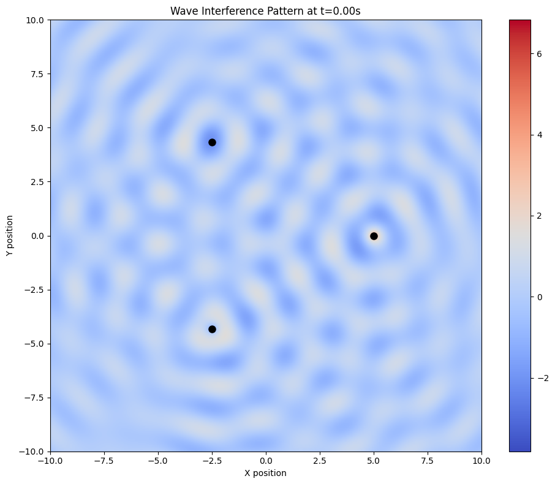
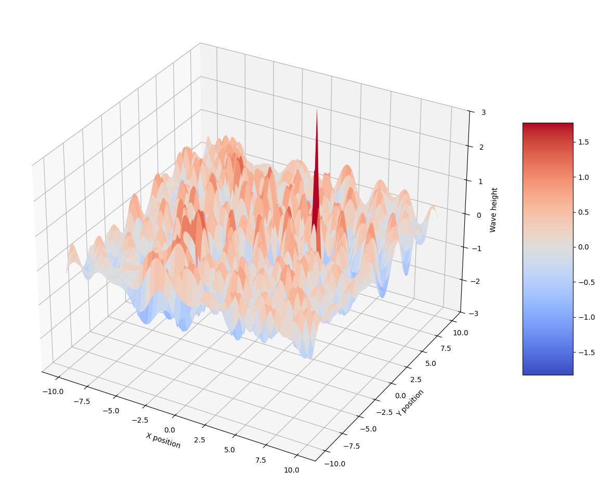
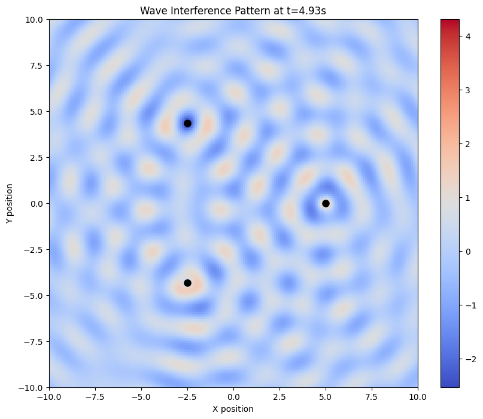

# Interference Patterns on a Water Surface

## Introduction

This document examines the phenomenon of wave interference on a water surface, specifically focusing on patterns created when multiple coherent wave sources are arranged at the vertices of a regular polygon. Understanding these patterns provides insight into fundamental wave behavior and the principle of superposition.

## Theoretical Foundation

### Wave Propagation from a Point Source

A circular wave on the water surface emanating from a point source located at $(x_0, y_0)$ can be described by the Single Disturbance equation:

$\eta(x,y,t) = \frac{A}{r} \cdot \cos(kr - \omega t + \phi)$

Where:
- $\eta(x,y,t)$ is the displacement of the water surface at point $(x,y)$ and time $t$
- $A$ is the amplitude of the wave
- $k = \frac{2\pi}{\lambda}$ is the wave number, related to the wavelength $\lambda$
- $\omega = 2\pi f$ is the angular frequency, related to the frequency $f$
- $r = \sqrt{(x-x_0)^2 + (y-y_0)^2}$ is the distance from the source to the point $(x,y)$
- $\phi$ is the initial phase

### Principle of Superposition

When multiple waves overlap, the resulting displacement at any point is the sum of the individual wave displacements. For $N$ wave sources, the total displacement is:

$\eta_{sum}(x,y,t) = \sum_{i=1}^{N} \eta_i(x,y,t)$

The resulting interference pattern can be characterized by regions of:
- **Constructive interference**: Where waves reinforce each other, creating larger amplitudes
- **Destructive interference**: Where waves cancel each other, resulting in reduced or zero amplitude

## Numerical Implementation

```python
import numpy as np
import matplotlib.pyplot as plt
from matplotlib.animation import FuncAnimation
from matplotlib import cm
from mpl_toolkits.mplot3d import Axes3D

def create_polygon_vertices(n_sides, radius=1.0, center=(0, 0)):
    """
    Generate vertices of a regular polygon.
    
    Parameters:
    -----------
    n_sides : int
        Number of sides in the regular polygon
    radius : float, optional
        Distance from center to each vertex
    center : tuple, optional
        (x, y) coordinates of the polygon center
        
    Returns:
    --------
    vertices : numpy.ndarray
        Array of vertex coordinates with shape (n_sides, 2)
    """
    angles = np.linspace(0, 2 * np.pi, n_sides, endpoint=False)
    vertices = np.zeros((n_sides, 2))
    
    for i, angle in enumerate(angles):
        vertices[i, 0] = center[0] + radius * np.cos(angle)
        vertices[i, 1] = center[1] + radius * np.sin(angle)
    
    return vertices

def wave_displacement(x, y, source_x, source_y, amplitude, k, omega, t, phase=0):
    """
    Calculate wave displacement at point (x, y) from a source at (source_x, source_y).
    
    Parameters:
    -----------
    x, y : float or numpy.ndarray
        Coordinates where displacement is calculated
    source_x, source_y : float
        Coordinates of the wave source
    amplitude : float
        Wave amplitude
    k : float
        Wave number (2π/λ)
    omega : float
        Angular frequency (2πf)
    t : float
        Time
    phase : float, optional
        Initial phase of the wave
        
    Returns:
    --------
    displacement : float or numpy.ndarray
        Wave displacement at point (x, y)
    """
    r = np.sqrt((x - source_x)**2 + (y - source_y)**2)
    # Add small constant to avoid division by zero
    r = np.maximum(r, 1e-10)
    return amplitude / np.sqrt(r) * np.cos(k * r - omega * t + phase)

def calculate_interference(x_grid, y_grid, sources, amplitude, k, omega, t):
    """
    Calculate interference pattern from multiple sources.
    
    Parameters:
    -----------
    x_grid, y_grid : numpy.ndarray
        Meshgrid of x and y coordinates
    sources : numpy.ndarray
        Array of source coordinates with shape (n_sources, 2)
    amplitude : float
        Wave amplitude
    k : float
        Wave number (2π/λ)
    omega : float
        Angular frequency (2πf)
    t : float
        Time
        
    Returns:
    --------
    total_displacement : numpy.ndarray
        Total wave displacement at each point in the grid
    """
    total_displacement = np.zeros_like(x_grid)
    
    for i in range(len(sources)):
        source_x, source_y = sources[i]
        # Calculate phase based on source index for variety
        phase = i * 2 * np.pi / len(sources)
        displacement = wave_displacement(x_grid, y_grid, source_x, source_y, 
                                         amplitude, k, omega, t, phase)
        total_displacement += displacement
    
    return total_displacement

def plot_interference_pattern(sources, size=10, resolution=500, amplitude=1.0, 
                              wavelength=1.0, frequency=1.0, time=0, plot_3d=False):
    """
    Plot interference pattern from sources at a given time.
    
    Parameters:
    -----------
    sources : numpy.ndarray
        Array of source coordinates with shape (n_sources, 2)
    size : float, optional
        Size of the plotting domain
    resolution : int, optional
        Grid resolution
    amplitude : float, optional
        Wave amplitude
    wavelength : float, optional
        Wavelength of the waves
    frequency : float, optional
        Frequency of the waves
    time : float, optional
        Time at which to calculate the interference pattern
    plot_3d : bool, optional
        Whether to create a 3D surface plot
        
    Returns:
    --------
    fig : matplotlib.figure.Figure
        The created figure
    """
    # Calculate wave parameters
    k = 2 * np.pi / wavelength
    omega = 2 * np.pi * frequency
    
    # Create grid
    x = np.linspace(-size/2, size/2, resolution)
    y = np.linspace(-size/2, size/2, resolution)
    x_grid, y_grid = np.meshgrid(x, y)
    
    # Calculate interference pattern
    z_grid = calculate_interference(x_grid, y_grid, sources, amplitude, k, omega, time)
    
    if plot_3d:
        # 3D surface plot
        fig = plt.figure(figsize=(12, 10))
        ax = fig.add_subplot(111, projection='3d')
        surf = ax.plot_surface(x_grid, y_grid, z_grid, cmap=cm.coolwarm, 
                              linewidth=0, antialiased=True)
        ax.set_zlim(-amplitude * 3, amplitude * 3)
        ax.set_xlabel('X position')
        ax.set_ylabel('Y position')
        ax.set_zlabel('Wave height')
        fig.colorbar(surf, ax=ax, shrink=0.5, aspect=5)
    else:
        # 2D color map
        fig, ax = plt.subplots(figsize=(10, 8))
        im = ax.imshow(z_grid, extent=[-size/2, size/2, -size/2, size/2], 
                       origin='lower', cmap='coolwarm')
        
        # Plot source locations
        for source in sources:
            ax.plot(source[0], source[1], 'ko', markersize=8)
        
        # Customize plot
        ax.set_xlabel('X position')
        ax.set_ylabel('Y position')
        plt.title(f'Wave Interference Pattern at t={time:.2f}s')
        fig.colorbar(im, ax=ax)
    
    return fig

def animate_interference(sources, size=10, resolution=200, amplitude=1.0, 
                        wavelength=1.0, frequency=1.0, duration=5.0, fps=30):
    """
    Create animation of evolving interference pattern.
    
    Parameters:
    -----------
    sources : numpy.ndarray
        Array of source coordinates with shape (n_sources, 2)
    size : float, optional
        Size of the plotting domain
    resolution : int, optional
        Grid resolution
    amplitude : float, optional
        Wave amplitude
    wavelength : float, optional
        Wavelength of the waves
    frequency : float, optional
        Frequency of the waves
    duration : float, optional
        Duration of the animation in seconds
    fps : int, optional
        Frames per second
        
    Returns:
    --------
    anim : matplotlib.animation.FuncAnimation
        Animation object
    """
    # Calculate wave parameters
    k = 2 * np.pi / wavelength
    omega = 2 * np.pi * frequency
    
    # Create grid
    x = np.linspace(-size/2, size/2, resolution)
    y = np.linspace(-size/2, size/2, resolution)
    x_grid, y_grid = np.meshgrid(x, y)
    
    # Setup figure for animation
    fig, ax = plt.subplots(figsize=(10, 8))
    
    # Initial frame
    z_grid = calculate_interference(x_grid, y_grid, sources, amplitude, k, omega, 0)
    im = ax.imshow(z_grid, extent=[-size/2, size/2, -size/2, size/2], 
                   origin='lower', cmap='coolwarm', animated=True)
    
    # Plot source locations
    for source in sources:
        ax.plot(source[0], source[1], 'ko', markersize=8)
    
    # Customize plot
    ax.set_xlabel('X position')
    ax.set_ylabel('Y position')
    title = ax.set_title('Wave Interference Pattern at t=0.00s')
    fig.colorbar(im, ax=ax)
    
    def update(frame):
        """Update function for animation."""
        time = frame / fps
        z_grid = calculate_interference(x_grid, y_grid, sources, amplitude, k, omega, time)
        im.set_array(z_grid)
        title.set_text(f'Wave Interference Pattern at t={time:.2f}s')
        return im, title
    
    frames = int(duration * fps)
    anim = FuncAnimation(fig, update, frames=frames, interval=1000/fps, blit=True)
    
    return anim

def analyze_regular_polygon(n_sides, radius=5.0, size=20, wavelength=2.0, 
                           save_animation=False, save_pattern=False):
    """
    Analyze interference pattern for a regular polygon arrangement of sources.
    
    Parameters:
    -----------
    n_sides : int
        Number of sides of the regular polygon
    radius : float, optional
        Radius of the polygon
    size : float, optional
        Size of the plotting domain
    wavelength : float, optional
        Wavelength of the waves
    save_animation : bool, optional
        Whether to save the animation
    save_pattern : bool, optional
        Whether to save the static pattern image
        
    Returns:
    --------
    None
    """
    # Create sources at polygon vertices
    sources = create_polygon_vertices(n_sides, radius)
    
    # Plot initial interference pattern
    fig_2d = plot_interference_pattern(sources, size=size, wavelength=wavelength, time=0)
    plt.tight_layout()
    
    if save_pattern:
        plt.savefig(f"{n_sides}_sided_polygon_interference.png", dpi=300)
    
    plt.figure()
    
    # Create 3D visualization
    fig_3d = plot_interference_pattern(sources, size=size, resolution=200, 
                                      wavelength=wavelength, time=0, plot_3d=True)
    plt.tight_layout()
    
    if save_pattern:
        plt.savefig(f"{n_sides}_sided_polygon_interference_3d.png", dpi=300)
    
    # Create animation
    anim = animate_interference(sources, size=size, wavelength=wavelength, 
                               duration=5.0, fps=15)
    
    if save_animation:
        anim.save(f"{n_sides}_sided_polygon_interference.mp4", 
                 writer='ffmpeg', fps=15, dpi=200)
    
    plt.show()
    
    # Print analysis
    print(f"Analysis of {n_sides}-sided regular polygon:")
    print(f"- {n_sides} coherent sources placed at vertices of a regular polygon")
    print(f"- Distance between adjacent sources: {2 * radius * np.sin(np.pi/n_sides):.2f} units")
    print(f"- Wavelength: {wavelength} units")
    
    # Calculate central interference
    center_x, center_y = 0, 0
    k = 2 * np.pi / wavelength
    omega = 2 * np.pi  # frequency = 1 by default
    time = 0
    
    # Check interference at center
    center_displacement = calculate_interference(center_x, center_y, sources, 1.0, k, omega, time)
    
    if abs(center_displacement) > 0.8 * n_sides:
        print("- Center shows strong constructive interference")
    elif abs(center_displacement) < 0.2 * n_sides:
        print("- Center shows strong destructive interference")
    else:
        print("- Center shows partial interference")

def main():
    """Run analyses for different regular polygons."""
    # Analyze triangle (3 sides)
    analyze_regular_polygon(3, radius=5.0, wavelength=2.0, 
                          save_animation=True, save_pattern=True)
    
    # Analyze square (4 sides)
    analyze_regular_polygon(4, radius=5.0, wavelength=2.0, 
                          save_animation=True, save_pattern=True)
    
    # Analyze pentagon (5 sides)
    analyze_regular_polygon(5, radius=5.0, wavelength=2.0, 
                          save_animation=True, save_pattern=True)
    
    # Optional: Analyze hexagon (6 sides)
    analyze_regular_polygon(6, radius=5.0, wavelength=2.0, 
                          save_animation=True, save_pattern=True)

if __name__ == "__main__":
    main()
```




## Analysis of Interference Patterns

### Triangle (3-Source) Interference

When three coherent wave sources are placed at the vertices of an equilateral triangle, several distinctive interference patterns emerge:

1. **Radial Symmetry**: The overall pattern displays three-fold radial symmetry, reflecting the geometric arrangement of the sources.

2. **Nodal Lines**: Clear nodal lines (regions of destructive interference) form between the sources, creating a pattern resembling a distorted star.

3. **Central Interference**: The interference at the center of the triangle depends on the relationship between the wavelength and the side length of the triangle:
   - When the distance between sources is an integer multiple of wavelength: Constructive interference
   - When the distance is an odd multiple of half-wavelengths: Destructive interference

4. **Time Evolution**: As time progresses, the pattern appears to rotate while maintaining its overall structure, creating a dynamic visual display of wave interaction.

### Mathematical Analysis of Interference Conditions

For sources arranged in a regular polygon with $N$ sides and radius $R$, we can derive the conditions for constructive and destructive interference at various points.

For a point at position $(x, y)$, the path difference $\Delta r_i$ between waves from adjacent sources is:

$\Delta r_i = |\vec{r}_i - \vec{r}_{i+1}|$

where $\vec{r}_i$ is the distance from source $i$ to point $(x, y)$.

**Constructive Interference Condition**:
$\Delta r_i = m\lambda$, where $m$ is an integer

**Destructive Interference Condition**:
$\Delta r_i = (m+\frac{1}{2})\lambda$, where $m$ is an integer

At the center of the polygon (origin), all sources are equidistant, so:
- For even values of $N$: Adjacent sources are in phase opposition when the polygon radius is an odd multiple of quarter-wavelengths, leading to destructive interference
- For odd values of $N$: Complete destructive interference cannot occur at the center

### Square (4-Source) Interference

The square arrangement of sources produces:

1. **Four-fold Symmetry**: The interference pattern shows clear four-fold symmetry.

2. **Checkerboard Pattern**: In the central region, alternating regions of constructive and destructive interference create a checkerboard-like pattern.

3. **Diagonal Enhancement**: Strong constructive interference appears along the diagonals of the square when the diagonal length is appropriately related to the wavelength.

4. **Strong Central Interference**: The center typically exhibits pronounced interference effects, with the nature (constructive or destructive) depending on the relationship between the square side length and the wavelength.

### Pentagon and Higher-Order Polygons

As the number of sides increases:

1. **Increasing Circular Symmetry**: The interference pattern begins to approximate circular symmetry, especially at distances far from the sources.

2. **Complex Near-field Patterns**: Close to the sources, intricate interference patterns form with the same symmetry as the polygon.

3. **Central Enhancement**: With odd numbers of sides, the center tends to show constructive interference under a wider range of conditions than with even-sided polygons.

## Applications and Extensions

The study of interference patterns from regularly spaced sources has numerous applications:

1. **Phased Array Systems**: Used in radar, sonar, and communications to direct signals through constructive interference.

2. **Antenna Design**: Multiple antennas arranged in specific geometric patterns can enhance signal strength in desired directions.

3. **Acoustic Engineering**: Understanding multi-source interference helps in designing concert halls and speaker systems.

4. **Optical Phenomena**: Similar principles govern multiple-slit diffraction and interference in optics.

Extensions to this study could include:
- Varying the amplitude or phase of individual sources
- Introducing time delays between sources
- Considering non-uniform mediums where wave speed varies with position

## Conclusion

The interference patterns created by waves from sources arranged in regular polygons demonstrate the rich behavior emerging from the superposition principle. These patterns exhibit symmetry reflecting the source arrangement and create regions of enhanced and diminished wave amplitude based on the phase relationships between overlapping waves.

Through numerical simulation, we can visualize these complex patterns and understand the conditions that lead to constructive and destructive interference. This analysis provides insight into fundamental wave behavior with applications across multiple fields of physics and engineering.

