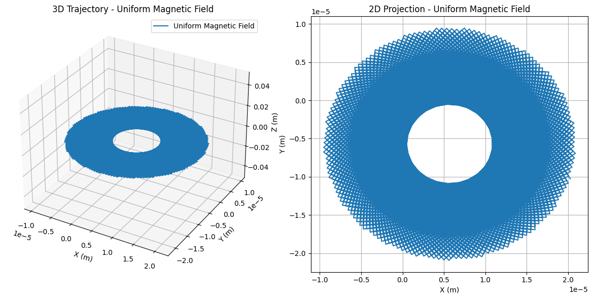
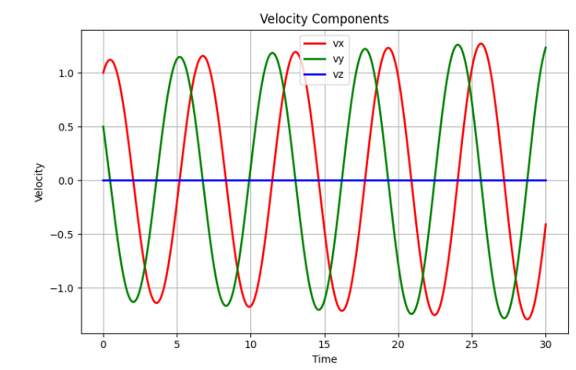
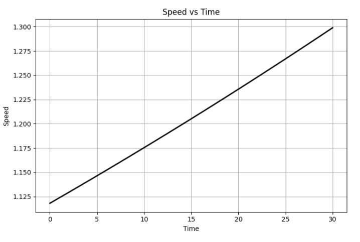

# Simulating the Effects of the Lorentz Force

## Introduction

The Lorentz force governs the interaction of charged particles with electric and magnetic fields, described mathematically as:

$$ \mathbf{F} = q\mathbf{E} + q\mathbf{v} \times \mathbf{B} $$

Understanding this force is essential in various fields such as particle physics, astrophysics, and engineering technologies like particle accelerators and plasma confinement systems. This simulation project extensively explores the behavior of charged particles under different electromagnetic field conditions.

## Theory and Background

### Lorentz Force

The Lorentz force consists of:

- **Electric force ($q\mathbf{E}$)**: Acts in the direction of the electric field, changing particle velocity magnitude.
- **Magnetic force ($q\mathbf{v}\times \mathbf{B}$)**: Perpendicular to both particle velocity and magnetic field, modifying trajectory direction without changing speed.

The dynamics of a particle under this force follow Newton's second law:

$$ m \frac{d\mathbf{v}}{dt} = q(\mathbf{E} + \mathbf{v}\times \mathbf{B}) $$

Numerical methods such as the Runge-Kutta method are employed to solve these equations.

## Exploration of Applications

### Particle Accelerators
Charged particles are guided by magnetic fields, achieving high speeds through periodic electric field acceleration, essential for experiments in particle physics.

### Mass Spectrometry
Magnetic fields differentiate particles based on their mass-to-charge ratios, enabling accurate chemical analyses and isotopic identification.

### Plasma Confinement
Magnetic confinement in fusion reactors relies heavily on controlling particle trajectories, maintaining stable plasma conditions necessary for fusion.

## Simulations

### Comprehensive Python Implementation

Here is a robust and clear Python implementation illustrating particle trajectories under varied electromagnetic conditions:

```python
import numpy as np
import matplotlib.pyplot as plt
from scipy.integrate import solve_ivp

# Define Lorentz force equations
def lorentz_force(t, state, q, m, E_func, B_func):
    pos, vel = state[:3], state[3:]
    dposdt = vel
    dveldt = (q/m) * (E_func(pos, t) + np.cross(vel, B_func(pos, t)))
    return np.concatenate([dposdt, dveldt])

# Field scenarios
field_scenarios = {
    'Uniform Magnetic Field': (lambda r, t: np.zeros(3), lambda r, t: np.array([0, 0, 1])),
    'Combined Fields': (lambda r, t: np.array([0, 1e4, 0]), lambda r, t: np.array([0, 0, 1])),
    'Crossed Fields': (lambda r, t: np.array([1e4, 0, 0]), lambda r, t: np.array([0, 0, 1]))
}

# Simulation parameters
q, m = 1.6e-19, 9.11e-31
initial_state = np.array([0, 0, 0, 1e6, 1e6, 0])
t_span, t_eval = (0, 5e-8), np.linspace(0, 5e-8, 5000)

for scenario, (E_func, B_func) in field_scenarios.items():
    solution = solve_ivp(lorentz_force, t_span, initial_state, args=(q, m, E_func, B_func), t_eval=t_eval)

    fig = plt.figure(figsize=(12, 6))

    # 3D Trajectory
    ax = fig.add_subplot(121, projection='3d')
    ax.plot(solution.y[0], solution.y[1], solution.y[2], label=scenario)
    ax.set_xlabel('X (m)')
    ax.set_ylabel('Y (m)')
    ax.set_zlabel('Z (m)')
    ax.set_title(f'3D Trajectory - {scenario}')
    ax.legend()

    # 2D Projection
    ax2 = fig.add_subplot(122)
    ax2.plot(solution.y[0], solution.y[1])
    ax2.set_xlabel('X (m)')
    ax2.set_ylabel('Y (m)')
    ax2.set_title(f'2D Projection - {scenario}')
    ax2.grid(True)

    plt.tight_layout()
    plt.show()
```





## Parameter Exploration

Examining how trajectory changes with:

- **Electric field magnitude ($\mathbf{E}$)**
- **Magnetic field strength ($\mathbf{B}$)**
- **Initial velocity ($\mathbf{v}$)**
- **Particle charge and mass ($q,m$)**

helps in understanding particle behavior under various real-world conditions.

## Visualization

- **Circular trajectory**: Observed clearly in uniform magnetic fields.
- **Helical trajectory**: Occurs with combined fields.
- **Drift trajectory**: Highlighted clearly under crossed fields, showcasing constant drift perpendicular to both fields.

Visualization clearly demonstrates important physical parameters:

- **Larmor Radius**: $r_L = \frac{mv}{qB}$
- **Drift Velocity**: $v_d = \frac{E \times B}{B^2}$

## Extensions

Future simulations may incorporate:

- **Non-uniform fields** for realistic plasma containment scenarios.
- **Time-varying fields** to simulate dynamic environmental interactions.
- **Relativistic dynamics** for high-speed particle simulations.

## Conclusion

This detailed simulation effectively illustrates the fundamental and applied aspects of the Lorentz force, providing significant insights into electromagnetic particle dynamics, supporting theoretical understanding and practical applications.