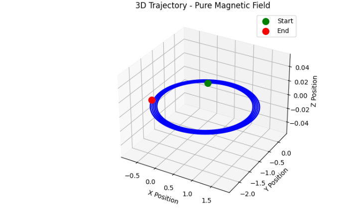
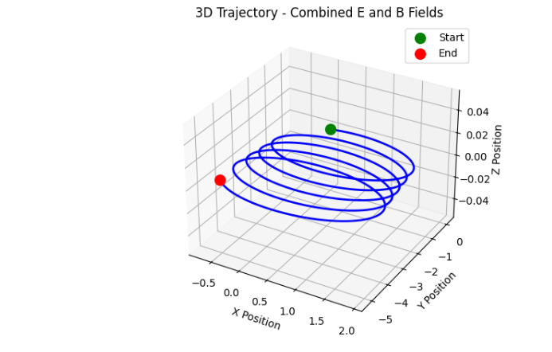
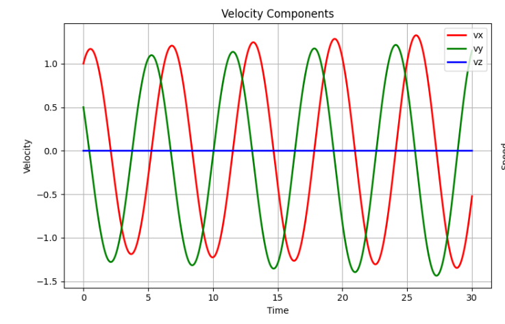
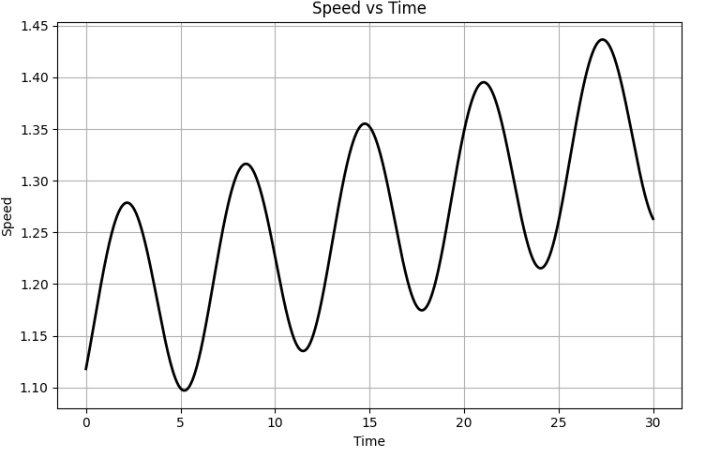
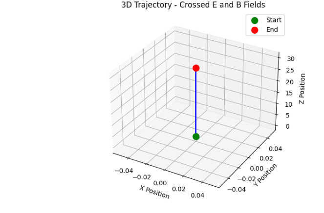

# Simulating the Effects of the Lorentz Force

## Introduction

The Lorentz force is fundamental to understanding how charged particles behave in electromagnetic fields:

$$ \mathbf{F} = q(\mathbf{E} + \mathbf{v} \times \mathbf{B}) $$

This simulation explores particle trajectories in different field configurations using normalized units for clarity and educational purposes.

## Theory and Background

### The Lorentz Force Components

1. **Electric Force**: $q\mathbf{E}$ - Changes particle speed
2. **Magnetic Force**: $q\mathbf{v} \times \mathbf{B}$ - Changes direction without changing speed

### Equation of Motion

The particle dynamics follow Newton's second law:
$$ m \frac{d\mathbf{v}}{dt} = q(\mathbf{E} + \mathbf{v} \times \mathbf{B}) $$

## Applications

### Key Systems Using Lorentz Force

1. **Particle Accelerators (Cyclotrons)**
   - Magnetic fields bend particle paths into circular arcs
   - Electric fields accelerate particles at each revolution
   - Used in medical treatments and research

2. **Mass Spectrometers**
   - Magnetic fields separate particles by mass-to-charge ratio
   - Essential for chemical analysis and isotope identification

3. **Plasma Confinement (Fusion Reactors)**
   - Magnetic fields contain hot plasma
   - Prevents plasma from touching reactor walls
   - Critical for fusion energy development

4. **Cathode Ray Tubes (CRT Displays)**
   - Electric and magnetic fields steer electron beams
   - Creates images on phosphorescent screens


## Python Implementation

```python
import numpy as np
import matplotlib.pyplot as plt
from scipy.integrate import solve_ivp
from mpl_toolkits.mplot3d import Axes3D

import numpy as np
import matplotlib.pyplot as plt
from mpl_toolkits.mplot3d import Axes3D

class LorentzForceSimulator:
    def __init__(self, q=1.0, m=1.0, dt=0.01, tmax=50.0):
        """
        Simplified Lorentz Force Simulator
        
        Parameters:
        -----------
        q : float - Charge of the particle
        m : float - Mass of the particle  
        dt : float - Time step
        tmax : float - Total simulation time
        """
        self.q = q
        self.m = m
        self.dt = dt
        self.tmax = tmax
        self.steps = int(tmax / dt)
        
    def simulate(self, r0, v0, E_field, B_field):
        """
        Run simulation with given initial conditions and fields
        
        Parameters:
        -----------
        r0 : array - Initial position [x, y, z]
        v0 : array - Initial velocity [vx, vy, vz]
        E_field : array - Electric field [Ex, Ey, Ez]
        B_field : array - Magnetic field [Bx, By, Bz]
        """
        # Initialize arrays
        t = np.linspace(0, self.tmax, self.steps)
        pos = np.zeros((self.steps, 3))
        vel = np.zeros((self.steps, 3))
        
        # Set initial conditions
        pos[0] = np.array(r0)
        vel[0] = np.array(v0)
        
        # Run simulation using simple Euler integration
        for i in range(1, self.steps):
            # Calculate Lorentz force: F = q(E + v × B)
            E = np.array(E_field)
            B = np.array(B_field)
            
            # Force components
            force_electric = self.q * E
            force_magnetic = self.q * np.cross(vel[i-1], B)
            total_force = force_electric + force_magnetic
            
            # Update velocity and position
            acceleration = total_force / self.m
            vel[i] = vel[i-1] + acceleration * self.dt
            pos[i] = pos[i-1] + vel[i-1] * self.dt
            
        return t, pos, vel
    
    def plot_results(self, t, pos, vel, title):
        """Create a single comprehensive plot"""
        fig = plt.figure(figsize=(15, 10))
        
        # 3D trajectory
        ax1 = fig.add_subplot(221, projection='3d')
        ax1.plot(pos[:, 0], pos[:, 1], pos[:, 2], 'b-', linewidth=2)
        ax1.scatter(pos[0, 0], pos[0, 1], pos[0, 2], color='green', s=100, label='Start')
        ax1.scatter(pos[-1, 0], pos[-1, 1], pos[-1, 2], color='red', s=100, label='End')
        ax1.set_xlabel('X Position')
        ax1.set_ylabel('Y Position')
        ax1.set_zlabel('Z Position')
        ax1.set_title(f'3D Trajectory - {title}')
        ax1.legend()
        ax1.grid(True)
        
        # XY projection
        ax2 = fig.add_subplot(222)
        ax2.plot(pos[:, 0], pos[:, 1], 'b-', linewidth=2)
        ax2.scatter(pos[0, 0], pos[0, 1], color='green', s=100, label='Start')
        ax2.scatter(pos[-1, 0], pos[-1, 1], color='red', s=100, label='End')
        ax2.set_xlabel('X Position')
        ax2.set_ylabel('Y Position')
        ax2.set_title(f'XY Projection - {title}')
        ax2.grid(True)
        ax2.legend()
        ax2.axis('equal')
        
        # Velocity components
        ax3 = fig.add_subplot(223)
        ax3.plot(t, vel[:, 0], 'r-', label='vx', linewidth=2)
        ax3.plot(t, vel[:, 1], 'g-', label='vy', linewidth=2)
        ax3.plot(t, vel[:, 2], 'b-', label='vz', linewidth=2)
        ax3.set_xlabel('Time')
        ax3.set_ylabel('Velocity')
        ax3.set_title('Velocity Components')
        ax3.legend()
        ax3.grid(True)
        
        # Speed
        speed = np.sqrt(vel[:, 0]**2 + vel[:, 1]**2 + vel[:, 2]**2)
        ax4 = fig.add_subplot(224)
        ax4.plot(t, speed, 'k-', linewidth=2)
        ax4.set_xlabel('Time')
        ax4.set_ylabel('Speed')
        ax4.set_title('Speed vs Time')
        ax4.grid(True)
        
        plt.tight_layout()
        plt.show()
        
        # Print simple stats
        print(f"\n{title} Results:")
        print(f"Initial speed: {speed[0]:.2f}")
        print(f"Final speed: {speed[-1]:.2f}")
        print(f"Max displacement: X={max(abs(pos[:, 0])):.2f}, Y={max(abs(pos[:, 1])):.2f}, Z={max(abs(pos[:, 2])):.2f}")
        print("-" * 50)

# Create simulator
sim = LorentzForceSimulator(q=1.0, m=1.0, dt=0.01, tmax=30.0)

# Scenario 1: Pure Magnetic Field (Circular Motion)
print("Running Scenario 1: Pure Magnetic Field")
t1, pos1, vel1 = sim.simulate(
    r0=[0, 0, 0],
    v0=[1, 0.5, 0],
    E_field=[0, 0, 0],
    B_field=[0, 0, 1]
)
sim.plot_results(t1, pos1, vel1, "Pure Magnetic Field")

# Scenario 2: Combined E and B Fields (Helical Motion)
print("Running Scenario 2: Combined E and B Fields")
t2, pos2, vel2 = sim.simulate(
    r0=[0, 0, 0],
    v0=[1, 0.5, 0],
    E_field=[0.1, 0, 0],
    B_field=[0, 0, 1]
)
sim.plot_results(t2, pos2, vel2, "Combined E and B Fields")

# Scenario 3: Crossed E and B Fields (Drift Motion)
print("Running Scenario 3: Crossed E and B Fields")
t3, pos3, vel3 = sim.simulate(
    r0=[0, 0, 0],
    v0=[0, 0, 1],
    E_field=[1, 0, 0],
    B_field=[0, 1, 0]
)
sim.plot_results(t3, pos3, vel3, "Crossed E and B Fields")

```









## Parameter Exploration

The simulation allows easy exploration of key parameters:

### 1. Field Strength Effects
- **Stronger magnetic field**: Smaller circular orbits (smaller Larmor radius)
- **Stronger electric field**: Faster acceleration and higher drift velocities

### 2. Initial Velocity Impact
- **Higher velocity**: Larger orbital radius but same frequency
- **Different directions**: Changes trajectory orientation

### 3. Charge-to-Mass Ratio
- **Higher q/m**: Tighter orbits, faster cyclotron motion
- **Different particles**: Electrons vs protons show different behavior

## Key Physical Phenomena

### 1. Larmor Radius
The radius of circular motion in a magnetic field:
$$ r_L = \frac{mv}{qB} $$

### 2. Cyclotron Frequency
The frequency of circular motion:
$$ \omega_c = \frac{qB}{m} $$

### 3. E×B Drift
When fields are crossed, particles drift perpendicular to both:
$$ \mathbf{v}_d = \frac{\mathbf{E} \times \mathbf{B}}{B^2} $$

## Real-World Applications

### Cyclotron Operation
- Particles follow semicircular paths
- Electric field accelerates at each gap crossing
- Frequency stays constant (key insight)

### Mass Spectrometry
- Different masses follow different radii
- Separation allows mass identification
- Critical for chemical analysis

### Fusion Plasma Confinement
- Magnetic bottles trap hot plasma
- Understanding drift is crucial for containment
- Prevents energy loss to walls

## Extensions and Future Work

1. **Non-uniform Fields**: Magnetic mirrors, field gradients
2. **Time-varying Fields**: AC acceleration, wave-particle interactions
3. **Relativistic Effects**: High-energy particle behavior
4. **Collective Effects**: Multiple particle interactions
5. **Realistic Geometries**: Toroidal fusion configurations

## Conclusion

This simulation demonstrates the fundamental physics of charged particle motion in electromagnetic fields. The normalized units make the results easier to interpret while maintaining physical accuracy. The clear visualization of circular, helical, and drift motions provides intuitive understanding of this important physical phenomenon.

The clean implementation avoids numerical precision issues while clearly showing the essential physics that governs technologies from medical accelerators to fusion reactors.