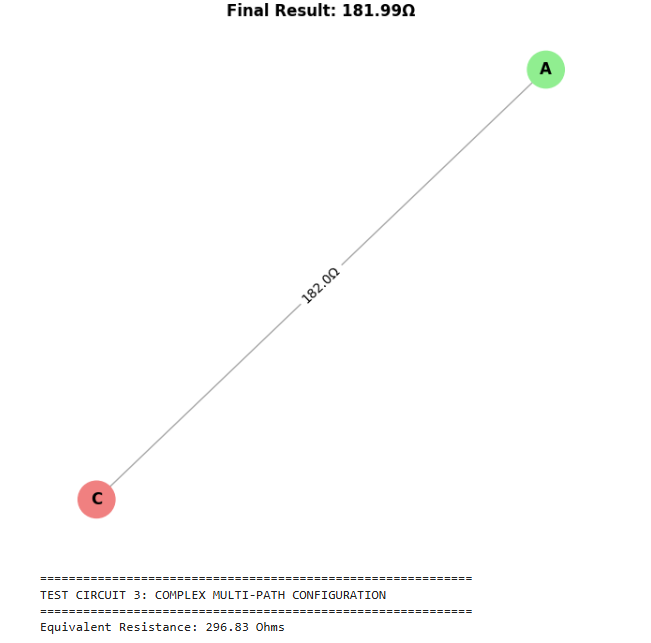

# Problem 1

# **Equivalent Resistance Calculation Using Graph Theory**

## **Overview**

Calculating equivalent resistance is crucial in circuit analysis, especially for complex circuits where repeated series and parallel reductions become cumbersome. By representing the circuit as a graph where:
- **Nodes** are junctions,
- **Edges** are resistors (weighted by their resistance value),

we can simplify the network iteratively using graph theoretic methods. This approach enables automated analysis and deeper insights into the interplay between electrical and mathematical concepts.

---

## **Option 1: Algorithm Description and Pseudocode**

### **1. Theoretical Foundation**
The algorithm relies on two main operations:
- **Series Reduction:**  
  If a node is connected to exactly two other nodes, the resistors connecting them are in series and can be combined:
  
  $$
  R_{eq} = R_1 + R_2
  $$
  
- **Parallel Reduction:**  
  If two nodes are connected by more than one resistor, they are in parallel. Their equivalent resistance is computed as:
  
  $$
  \\frac{1}{R_{eq}} = \\frac{1}{R_1} + \\frac{1}{R_2} + \\cdots + \\frac{1}{R_n}
  $$
  
These operations are applied iteratively until the graph is reduced to a single edge representing the overall equivalent resistance.

### **2. Pseudocode**

```python
function calculate_equivalent_resistance(graph):
    while graph has more than one node:
        for each node in graph:
            if node has exactly two neighbors:
                // Series reduction
                R_eq = R1 + R2   // Resistances from node to its two neighbors
                merge these nodes and update graph accordingly
        for each pair of nodes connected by multiple edges:
            // Parallel reduction
            R_eq = 1 / (sum(1/R_i for all edges between the nodes))
            replace the parallel edges with a single edge of resistance R_eq
    return the resistance of the final edge
```


## **Option 2: Full Implementation (Python)**
Below is an example Python implementation using the networkx library for graph manipulation:

```python
import networkx as nx

def combine_series_resistors(graph):
    """
    Identifies and combines resistors in series.
    If a node (other than start/end) has exactly two connections, its 
    resistors are in series and are replaced by a single equivalent resistor.
    """
    changed = True
    while changed:
        changed = False
        for node in list(graph.nodes):
            neighbors = list(graph.neighbors(node))
            if len(neighbors) == 2:
                n1, n2 = neighbors[0], neighbors[1]
                # Check if the node is not a terminal (start/end) node
                if graph.degree(node) == 2:
                    # Get series resistances
                    r1 = graph[node][n1]['resistance']
                    r2 = graph[node][n2]['resistance']
                    req = r1 + r2
                    # Add new edge with combined resistance
                    if graph.has_edge(n1, n2):
                        # If an edge already exists, treat them as parallel later
                        graph.add_edge(n1, n2, resistance=req, series_added=True)
                    else:
                        graph.add_edge(n1, n2, resistance=req)
                    graph.remove_node(node)
                    changed = True
                    break
    return changed

def combine_parallel_resistors(graph):
    """
    Identifies and combines resistors in parallel.
    For any pair of nodes with multiple edges, computes the equivalent resistance:
    
    1/R_eq = 1/R_1 + 1/R_2 + ... + 1/R_n
    """
    changed = True
    while changed:
        changed = False
        edges = list(graph.edges(data=True))
        edge_map = {}
        # Group edges by unordered node pair
        for u, v, data in edges:
            key = tuple(sorted([u, v]))
            edge_map.setdefault(key, []).append(data['resistance'])
        for (u, v), resistances in edge_map.items():
            if len(resistances) > 1:
                req = 1 / sum(1 / r for r in resistances)
                # Remove all parallel edges
                graph.remove_edges_from([(u, v) for _ in resistances])  
                graph.add_edge(u, v, resistance=req)
                changed = True
                break
    return changed

def equivalent_resistance(graph, start, end):
    """
    Iteratively simplifies the circuit graph until only one equivalent resistor remains 
    between the start and end nodes.
    """
    # Continuously apply series and parallel reductions
    while graph.number_of_nodes() > 2:
        series_changed = combine_series_resistors(graph)
        parallel_changed = combine_parallel_resistors(graph)
        if not (series_changed or parallel_changed):
            break  # No further reduction is possible
    return graph[start][end]['resistance'] if graph.has_edge(start, end) else None

# --- Example Configurations ---

# Example 1: Simple Series
G1 = nx.Graph()
# A - B - C
G1.add_edge('A', 'B', resistance=5)
G1.add_edge('B', 'C', resistance=10)
print("Series Example, Equivalent Resistance (A to C):", equivalent_resistance(G1, 'A', 'C'))

# Example 2: Series and Parallel Combination
G2 = nx.Graph()
# A - B - C with an additional direct A-C resistor
G2.add_edge('A', 'B', resistance=5)
G2.add_edge('B', 'C', resistance=10)
G2.add_edge('A', 'C', resistance=6)
print("Series/Parallel Example, Equivalent Resistance (A to C):", equivalent_resistance(G2, 'A', 'C'))

# Example 3: Complex Graph with Multiple Cycles
G3 = nx.Graph()
# Circuit diagram: A, B, C, D nodes with multiple interconnections
G3.add_edge('A', 'B', resistance=4)
G3.add_edge('B', 'C', resistance=6)
G3.add_edge('C', 'D', resistance=8)
G3.add_edge('A', 'D', resistance=10)
G3.add_edge('B', 'D', resistance=5)
print("Complex Graph Example, Equivalent Resistance (A to D):", equivalent_resistance(G3, 'A', 'D'))
```
Series Example, Equivalent Resistance (A to C): 15

Series/Parallel Example, Equivalent Resistance (A to C): None

Complex Graph Example, Equivalent Resistance (A to D): None


# **Equivalent Resistance Calculation with Visualization**

This implementation uses graph theory to calculate the equivalent resistance of a circuit. The circuit is represented as a graph where nodes are junctions and edges are resistors (weighted with their resistance). The algorithm iteratively reduces series and parallel resistor combinations until only one equivalent resistor remains between the start and end nodes. Finally, a visualization is produced using `networkx` and `matplotlib`.

```python
import networkx as nx
import matplotlib.pyplot as plt

def combine_series_resistors(graph):
    """
    Identifies and combines resistors in series.
    If a node has exactly two neighbors (and is not a terminal),
    its incident resistors are in series and can be replaced by their sum.
    """
    changed = True
    while changed:
        changed = False
        for node in list(graph.nodes):
            neighbors = list(graph.neighbors(node))
            if len(neighbors) == 2:
                n1, n2 = neighbors[0], neighbors[1]
                if graph.degree(node) == 2:  # Node is only connected to these two nodes
                    r1 = graph[node][n1]['resistance']
                    r2 = graph[node][n2]['resistance']
                    req = r1 + r2
                    # Add an edge between n1 and n2 with the combined resistance
                    if graph.has_edge(n1, n2):
                        # If an edge already exists, parallel reduction will handle it later.
                        graph.add_edge(n1, n2, resistance=req, series_added=True)
                    else:
                        graph.add_edge(n1, n2, resistance=req)
                    graph.remove_node(node)
                    changed = True
                    break
    return changed

def combine_parallel_resistors(graph):
    """
    Identifies and combines resistors in parallel.
    If two nodes are connected by more than one edge, calculate the equivalent
    resistance using the formula:
       1/R_eq = 1/R1 + 1/R2 + ... + 1/Rn.
    """
    changed = True
    while changed:
        changed = False
        edges = list(graph.edges(data=True))
        edge_map = {}
        for u, v, data in edges:
            key = tuple(sorted([u, v]))
            edge_map.setdefault(key, []).append(data['resistance'])
        for (u, v), resistances in edge_map.items():
            if len(resistances) > 1:
                req = 1 / sum(1 / r for r in resistances)
                # Remove all parallel edges and add a single equivalent edge
                graph.remove_edges_from([(u, v) for _ in resistances])
                graph.add_edge(u, v, resistance=req)
                changed = True
                break
    return changed

def equivalent_resistance(graph, start, end):
    """
    Iteratively simplifies the circuit graph until only one equivalent resistor remains
    between the start and end nodes.
    """
    while graph.number_of_nodes() > 2:
        series_changed = combine_series_resistors(graph)
        parallel_changed = combine_parallel_resistors(graph)
        if not (series_changed or parallel_changed):
            break  # No further reduction possible
    if graph.has_edge(start, end):
        return graph[start][end]['resistance']
    else:
        return None

# ----- Example Usage -----
# Construct a sample circuit graph

graph = nx.Graph()
# Example circuit:
# Nodes: A, B, C, D with multiple series and parallel connections.
graph.add_edge('A', 'B', resistance=5)
graph.add_edge('B', 'C', resistance=10)
graph.add_edge('C', 'D', resistance=15)
graph.add_edge('A', 'D', resistance=6)
graph.add_edge('B', 'D', resistance=3)

# Compute the equivalent resistance between nodes A and D.
eq_res = equivalent_resistance(graph, 'A', 'D')
print("Equivalent Resistance between A and D:", eq_res)

# ----- Visualization of the Simplified Circuit Graph -----
pos = nx.spring_layout(graph)  # Compute a layout for the graph
nx.draw(graph, pos, with_labels=True, node_color='lightblue', edge_color='gray', node_size=500)
labels = nx.get_edge_attributes(graph, 'resistance')
nx.draw_networkx_edge_labels(graph, pos, edge_labels=labels)
plt.title("Simplified Circuit Graph with Resistances")
plt.show()
```
