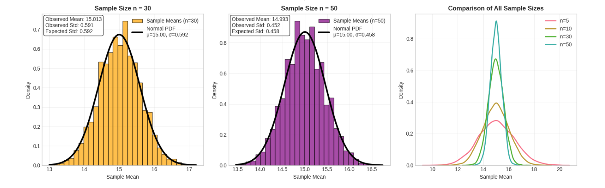

# Problem 1
# **1. Simulating Sampling Distributions**

## **Selected Population Distributions**

We'll use the following types:

- **Uniform Distribution** (e.g., between 0 and 1)
- **Exponential Distribution** (e.g., scale = 1.0)
- **Binomial Distribution** (e.g., $n = 10$, $p = 0.5$)

---

## **Python Code to Generate Populations**

```python
import numpy as np
import matplotlib.pyplot as plt
import seaborn as sns

# Set random seed for reproducibility
np.random.seed(42)

# Population sizes
pop_size = 100000

# Generate populations
uniform_pop = np.random.uniform(0, 1, pop_size)
exponential_pop = np.random.exponential(scale=1.0, size=pop_size)
binomial_pop = np.random.binomial(n=10, p=0.5, size=pop_size)

# Plot each distribution
plt.figure(figsize=(15, 4))

# Uniform
plt.subplot(1, 3, 1)
sns.histplot(uniform_pop, kde=True, bins=50, color='skyblue')
plt.title("Uniform Distribution")

# Exponential
plt.subplot(1, 3, 2)
sns.histplot(exponential_pop, kde=True, bins=50, color='orange')
plt.title("Exponential Distribution")

# Binomial
plt.subplot(1, 3, 3)
sns.histplot(binomial_pop, kde=True, bins=50, color='green')
plt.title("Binomial Distribution")

plt.tight_layout()
plt.show()
```


# **2. Sampling and Visualization**

## **Sampling Strategy**

- Choose different sample sizes: **5, 10, 30, 50**
- Draw many random samples (e.g., 1000 samples per size)
- Calculate the **sample mean** for each sample
- Plot the distribution of sample means

---

## **Python Code for Sampling and Plotting**

```python
import numpy as np
import matplotlib.pyplot as plt
import seaborn as sns

# Define population (you can change this to uniform_pop, exponential_pop, etc.)
population = np.random.exponential(scale=1.0, size=100000)

# Sample sizes to test
sample_sizes = [5, 10, 30, 50]
num_samples = 1000  # Repetitions per sample size

# Set up plot
plt.figure(figsize=(15, 8))

for i, n in enumerate(sample_sizes):
    sample_means = []
    for _ in range(num_samples):
        sample = np.random.choice(population, size=n)
        sample_means.append(np.mean(sample))
    
    # Plot histogram of sample means
    plt.subplot(2, 2, i+1)
    sns.histplot(sample_means, kde=True, bins=30, color='purple')
    plt.title(f'Sample Size = {n}')
    plt.xlabel('Sample Mean')
    plt.ylabel('Frequency')

plt.tight_layout()
plt.suptitle("Sampling Distributions of the Mean", y=1.02, fontsize=16)
plt.show()
```



# **3. Parameter Exploration**

## **Key Factors to Investigate**

- **Original distribution shape:**
  - Symmetric (Uniform)
  - Skewed (Exponential)
  - Discrete (Binomial)

- **Sample size:**
  - Small (e.g., 5–10) → slow convergence
  - Larger (e.g., 30–50) → faster convergence

- **Population variance:**
  - Affects **spread** of the sampling distribution
  - High variance → **wider** sampling distribution

---

## **Observations to Highlight**

- **Exponential Distribution:**  
  Strongly skewed, but sample means become symmetric with larger $n$.

- **Uniform Distribution:**  
  Converges quickly since it’s already bounded and symmetric.

- **Binomial Distribution (with low $n$):**  
  Discrete jumps are visible, but smooth out with sampling.

- **Higher Variance = Slower Convergence:**  
  Sample means spread out more, requiring **larger $n$** to approach normality.


# **4. Practical Applications of the Central Limit Theorem**

## **Why CLT Matters**

The **Central Limit Theorem (CLT)** is critical in statistics because it allows us to make predictions and decisions based on **sample data**, even if the population distribution is unknown.

---

## **Estimating Population Parameters**

- Sample means follow a **normal distribution** for large enough samples.
- Enables construction of **confidence intervals** and **hypothesis testing**.
- Used in surveys, experiments, and polling (e.g., predicting election outcomes).

---

## **Quality Control in Manufacturing**

- CLT helps track **mean product quality** over time.
- Sample-based control charts rely on the assumption that the mean of measurements is **normally distributed**.
- Essential for detecting shifts or defects in production.

---

## **Financial Modeling**

- Returns and risks are modeled assuming **normally distributed averages**.
- CLT justifies using **sample averages** to estimate expected returns or volatility.
- Supports **risk analysis** and **portfolio optimization**.

---


