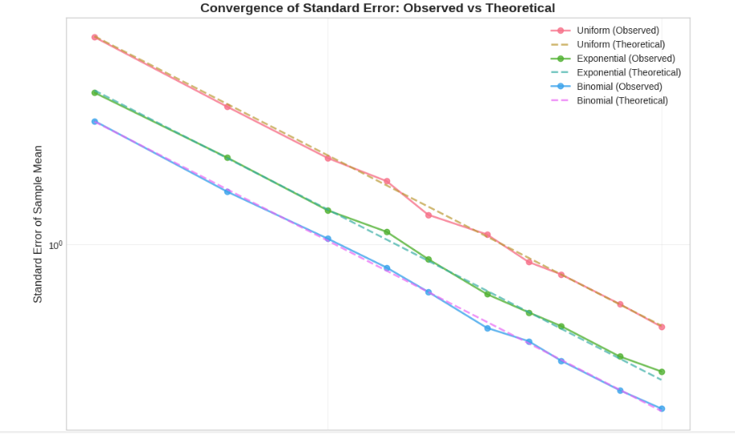
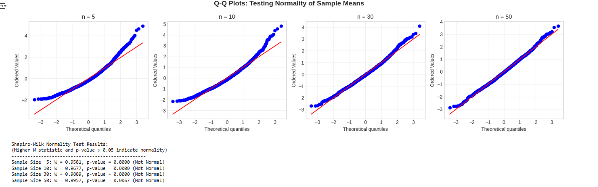

# Problem 2
# **Estimating π Using Monte Carlo – Circle Method**

---

## **1. Theoretical Foundation**

We estimate π by simulating points in a square and checking how many fall inside an inscribed circle.

- For a **unit circle** centered at the origin, any point $(x, y)$ lies inside the circle if:

$$
x^2 + y^2 \leq 1
$$

- The area of the full square is $4$ (from $[-1, 1] \times [-1, 1]$).
- The area of the unit circle is $π$.

The ratio of points inside the circle to the total points approximates the ratio of their areas:

$$
\frac{\text{Points in Circle}}{\text{Total Points}} \approx \frac{π}{4}
$$

Rearranging:

$$
π \approx 4 \cdot \frac{\text{Points in Circle}}{\text{Total Points}}
$$

---


## **2. Simulation – Estimating π**

```python
import numpy as np

def estimate_pi(num_points=10000):
    x = np.random.uniform(-1, 1, num_points)
    y = np.random.uniform(-1, 1, num_points)
    
    inside_circle = x**2 + y**2 <= 1
    pi_estimate = 4 * np.sum(inside_circle) / num_points
    return pi_estimate, x, y, inside_circle

# Example usage
pi, x_vals, y_vals, mask = estimate_pi(10000)
print(f"Estimated π ≈ {pi}")
```
Estimated π ≈ 3.1548


## **3. Visualization of Points**
```python
import matplotlib.pyplot as plt

def plot_points(x, y, inside_circle):
    plt.figure(figsize=(6,6))
    plt.scatter(x[inside_circle], y[inside_circle], s=1, color='green', label='Inside Circle')
    plt.scatter(x[~inside_circle], y[~inside_circle], s=1, color='red', label='Outside Circle')
    plt.gca().set_aspect('equal')
    plt.title("Monte Carlo π Estimation")
    plt.xlabel("X")
    plt.ylabel("Y")
    plt.legend()
    plt.grid(True)
    plt.show()

plot_points(x_vals, y_vals, mask)
```



## **4. Accuracy and Convergence**

### **Observing Convergencee**
```python
import matplotlib.pyplot as plt

sample_sizes = [10, 100, 1000, 5000, 10000, 50000, 100000]
estimates = []

for n in sample_sizes:
    pi_est, *_ = estimate_pi(n)
    estimates.append(pi_est)

plt.plot(sample_sizes, estimates, marker='o')
plt.axhline(np.pi, color='red', linestyle='--', label='True π')
plt.title("Convergence of π Estimate")
plt.xlabel("Number of Points")
plt.ylabel("Estimated π")
plt.legend()
plt.grid(True)
plt.xscale('log')
plt.show()
```



# **Estimating π Using Buffon’s Needle**

---

## **1. Theoretical Foundation**

### **Problem Description**

Buffon’s Needle is a classic probability problem:

- Drop a needle of length $L$ onto a plane with equally spaced parallel lines a distance $d$ apart.
- The probability $P$ of the needle crossing a line is related to $π$:

$$
P = \frac{2L}{dπ}
$$

### **Deriving π**

Rearranged to estimate π:

$$
π \approx \frac{2L \cdot N}{d \cdot C}
$$

Where:
- $L$ = needle length
- $d$ = distance between lines
- $N$ = total number of throws
- $C$ = number of times the needle crosses a line

Note: Valid only when $L \leq d$

---

## **2. Simulation**

```python
import numpy as np

def buffon_needle(num_throws=10000, L=1.0, d=1.5):
    assert L <= d, "Needle length must be less than or equal to spacing between lines."

    # Random needle midpoints and angles
    y_center = np.random.uniform(0, d / 2, num_throws)
    theta = np.random.uniform(0, np.pi / 2, num_throws)

    # Check if needle crosses a line
    crosses = y_center <= (L / 2) * np.sin(theta)
    num_crosses = np.sum(crosses)

    # Estimate π
    if num_crosses == 0:
        return None  # Avoid division by zero
    pi_est = (2 * L * num_throws) / (d * num_crosses)
    return pi_est, y_center, theta, crosses
```
only runs the calculation — it doesn't produce a plot by itself.


## **3. Visualization**

```python
import matplotlib.pyplot as plt

def plot_needles(y_center, theta, crosses, L=1.0, d=1.5, num_shown=200):
    x_center = np.zeros_like(y_center)
    dx = (L / 2) * np.cos(theta)
    dy = (L / 2) * np.sin(theta)

    plt.figure(figsize=(8, 6))
    for i in range(min(num_shown, len(y_center))):
        x0 = x_center[i] - dx[i]
        x1 = x_center[i] + dx[i]
        y0 = y_center[i] - dy[i]
        y1 = y_center[i] + dy[i]
        color = 'red' if crosses[i] else 'blue'
        plt.plot([x0, x1], [y0, y1], color=color)

    # Draw parallel lines
    for y in np.arange(0, 10*d, d):
        plt.axhline(y, color='black', linewidth=0.5, linestyle='--')

    plt.title("Buffon’s Needle Simulation (Red = Crossing)")
    plt.xlabel("X")
    plt.ylabel("Y")
    plt.axis('equal')
    plt.grid(True)
    plt.show()
```
It doesnt produce a plot because it needs input from the simulation first.
The following code below builds on the Buffon’s Needle simulation and includes a visual representation of the needle drops:

- Red needles indicate those that **crossed** a line.
- Blue needles indicate those that **did not cross**.
- Dashed black lines represent the **parallel floor lines**.
- This visualization helps us understand how the estimate of π is formed geometrically.

It uses the output from the simulation to produce an intuitive and engaging plot of the experiment.

```python
import numpy as np
import matplotlib.pyplot as plt

# --- Buffon’s Needle Simulation ---
def buffon_needle(num_throws=1000, L=1.0, d=1.5):
    assert L <= d, "Needle length must be less than or equal to spacing between lines."

    # Generate random midpoints and angles
    y_center = np.random.uniform(0, d / 2, num_throws)
    theta = np.random.uniform(0, np.pi / 2, num_throws)

    # Check if needle crosses a line
    crosses = y_center <= (L / 2) * np.sin(theta)
    num_crosses = np.sum(crosses)

    if num_crosses == 0:
        return None, y_center, theta, crosses  # Avoid division by zero

    # Estimate π
    pi_estimate = (2 * L * num_throws) / (d * num_crosses)
    return pi_estimate, y_center, theta, crosses

# --- Needle Plotting Function ---
def plot_needles(y_center, theta, crosses, L=1.0, d=1.5, num_shown=300):
    x_center = np.zeros_like(y_center)
    dx = (L / 2) * np.cos(theta)
    dy = (L / 2) * np.sin(theta)

    plt.figure(figsize=(8, 6))
    for i in range(min(num_shown, len(y_center))):
        x0 = x_center[i] - dx[i]
        x1 = x_center[i] + dx[i]
        y0 = y_center[i] - dy[i]
        y1 = y_center[i] + dy[i]
        color = 'red' if crosses[i] else 'blue'
        plt.plot([x0, x1], [y0, y1], color=color, linewidth=0.8)

    # Draw parallel lines
    for y in np.arange(0, 10 * d, d):
        plt.axhline(y, color='black', linewidth=0.5, linestyle='--')

    plt.title("Buffon’s Needle Simulation (Red = Crossed Line)")
    plt.xlabel("X")
    plt.ylabel("Y")
    plt.axis("equal")
    plt.grid(True)
    plt.show()

# --- Run Simulation and Plot ---
pi_val, y_vals, theta_vals, cross_mask = buffon_needle(num_throws=1000)
print(f"Estimated π ≈ {pi_val:.6f}")

plot_needles(y_vals, theta_vals, cross_mask)
```


## **4. Analysis of Accuracy and Convergence**

```python
sample_sizes = [100, 500, 1000, 5000, 10000, 50000]
pi_estimates = []

for n in sample_sizes:
    pi_val, *_ = buffon_needle(num_throws=n)
    pi_estimates.append(pi_val)

plt.plot(sample_sizes, pi_estimates, marker='o')
plt.axhline(np.pi, color='green', linestyle='--', label='True π')
plt.title("Buffon’s Needle: Convergence of π Estimate")
plt.xlabel("Number of Needle Drops")
plt.ylabel("Estimated π")
plt.legend()
plt.grid(True)
plt.xscale("log")
plt.show()
```
