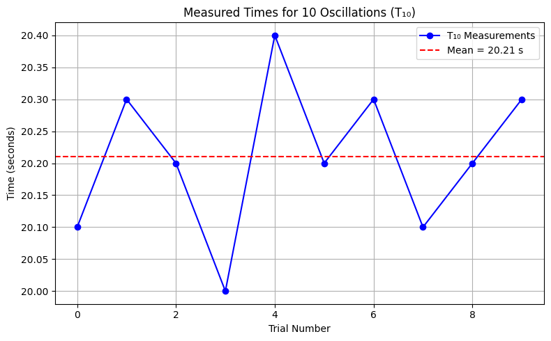

## Problem 1: Measuring Earth's Gravitational Acceleration with a Pendulum

### Motivation
The acceleration due to gravity ($g$) is a fundamental physical constant that affects a wide variety of phenomena. Accurate measurement of $g$ is essential in understanding gravitational interactions, engineering applications, and experimental physics. One reliable method to determine $g$ is through the oscillation period of a simple pendulum. The relationship between the pendulum's period and its length allows us to estimate $g$ while also analyzing the impact of measurement uncertainties.

### Task
Measure the local gravitational acceleration $g$ using a pendulum setup. Carefully analyze uncertainties to understand the precision of your measurements and how experimental limitations influence the final result.

### Procedure

#### 1. Materials
- A string (1 or 1.5 meters long).
- A small mass (e.g., a metal washer, keychain, or small bag).
- Stopwatch (or smartphone timer).
- Ruler or measuring tape.

#### 2. Setup
- Securely attach the weight to the end of the string and fix the other end to a stable point.
- Measure the length $L$ of the pendulum from the suspension point to the center of the mass. Record the ruler resolution \(\Delta L\) as:

$$
    \Delta L = \frac{\text{Ruler Resolution}}{2}
$$

#### 3. Data Collection
- Displace the pendulum by a small angle (<15°) and release.
- Measure the time for 10 oscillations ($T_{10}$). Repeat this 10 times.
- Compute the average $\overline{T_{10}}$ and standard deviation $\sigma_{T}$.
- Determine the uncertainty in the mean time:

$$
    \Delta T_{10} = \frac{\sigma_T}{\sqrt{n}} \quad \text{where } n = 10
$$

### Calculations

#### 1. Calculate the Period
$$
 T = \frac{\overline{T_{10}}}{10} \quad \text{and} \quad \Delta T = \frac{\Delta T_{10}}{10}
$$

#### 2. Determine g
$$
g = \frac{4\pi^2 L}{T^2}
$$

#### 3. Propagate Uncertainties
$$
\Delta g = g \sqrt{ \left(\frac{\Delta L}{L}\right)^2 + \left(\frac{2 \Delta T}{T}\right)^2 }
$$

### Python Code for Analysis
```python
import numpy as np

# Sample data (user should replace with actual values)
L = 1.00  # length of pendulum in meters
ruler_resolution = 0.01  # in meters
T10_measurements = [20.1, 20.3, 20.2, 20.0, 20.4, 20.2, 20.3, 20.1, 20.2, 20.3]  # in seconds

# Calculations
n = len(T10_measurements)
T10_array = np.array(T10_measurements)
T10_mean = np.mean(T10_array)
sigma_T10 = np.std(T10_array, ddof=1)
Delta_T10 = sigma_T10 / np.sqrt(n)

T = T10_mean / 10
Delta_T = Delta_T10 / 10

Delta_L = ruler_resolution / 2

g = (4 * np.pi**2 * L) / (T**2)
Delta_g = g * np.sqrt((Delta_L / L)**2 + ((2 * Delta_T) / T)**2)

# Output
print(f"Mean T10: {T10_mean:.4f} s")
print(f"Standard deviation (σ_T10): {sigma_T10:.4f} s")
print(f"Period T: {T:.4f} s")
print(f"g = {g:.4f} m/s²")
print(f"Uncertainty in g (Δg): {Delta_g:.4f} m/s²")

import matplotlib.pyplot as plt

# Plot individual T10 measurements
plt.figure(figsize=(8, 5))
plt.plot(T10_measurements, marker='o', linestyle='-', color='blue', label='T₁₀ Measurements')
plt.axhline(T10_mean, color='red', linestyle='--', label=f'Mean = {T10_mean:.2f} s')
plt.title("Measured Times for 10 Oscillations (T₁₀)")
plt.xlabel("Trial Number")
plt.ylabel("Time (seconds)")
plt.grid(True)
plt.legend()
plt.tight_layout()

# Show plot
plt.show()

# Optionally save plot
plt.savefig("pendulum_T10_measurements.png", dpi=300)

```



### Analysis
1. Compare your measured $g$ with the accepted standard value ($9.81\, m/s^2$).
2. Discuss:
   - The effect of measurement resolution on $\Delta L$.
   - Timing variability and its impact on $\Delta T$.
   - Experimental assumptions and sources of error (e.g., air resistance, angle, stopwatch lag).

### Deliverables
1. A Markdown table including:
   - Measured $L$, $\Delta L$, 10 values of $T_{10}$, $\overline{T_{10}}$, $\sigma_T$, and $\Delta T$.
   - Calculated values of $g$ and $\Delta g$.
2. A discussion on:
   - Sources of uncertainty.
   - Comparison to standard gravity.
   - How measurement practices affect result reliability.
